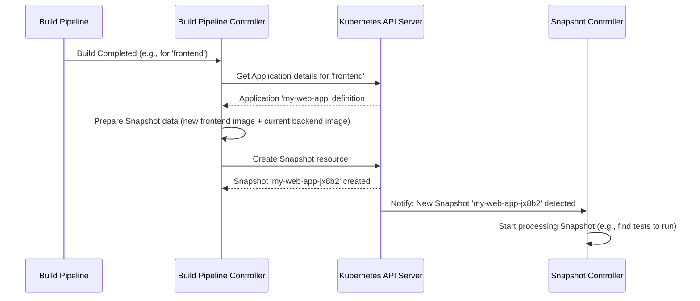

# Chapter 1: Snapshot

Welcome to the `integration-service` tutorial! This service helps automate the testing and integration of different parts of your application after they are built.

Imagine you're building a house with several teams working on different parts – one team does the plumbing, another the electricity, and another the framing. After each team finishes a major task (like installing all the pipes), you want to take a detailed picture of the *entire* house at that exact moment. This picture captures the state of the plumbing, electricity, and framing *together*. Later, you can use this picture to check if everything fits correctly or to show inspectors exactly what was done at that point.

In software development with multiple components (like a frontend, backend, database service), we face a similar challenge. When a new version of one component is built (e.g., the frontend), how do we capture the exact state of *all* components at that moment so we can reliably test them together?

This is where the **Snapshot** comes in.

## What is a Snapshot?

A **Snapshot** is like that photograph of your house. It's a record created automatically by the `integration-service` right after a build pipeline finishes for any component of your application. This record captures:

1.  **Which Application:** The application the Snapshot belongs to.
2.  **All Components:** A list of all the parts (components) that make up your application at that time.
3.  **Exact Container Images:** For *each* component, the precise container image that was just built or the one that was most recently known to be good. This isn't just the image tag (like `latest`), but the unique, unchangeable identifier called a **digest** (it looks like `sha256:abcdef123...`).

Think of it as a bill of materials for a specific build moment, ensuring you know *exactly* which version of each microservice or library was produced.

## Why Do We Need Snapshots?

Snapshots solve a critical problem: **reproducibility and consistency in testing**.

Without Snapshots, you might run tests like this: "Test the `latest` frontend image with the `latest` backend image." But what if the backend team pushes a new `latest` image right *during* your frontend tests? Your test environment changes mid-test, leading to confusing or unreliable results.

Snapshots prevent this. They ensure that:

*   **Tests run against a fixed set:** When we run integration tests, we use the Snapshot to deploy the *exact* image versions specified in it. No surprises.
*   **Traceability:** We have a clear record linking a specific build event to the exact set of component versions tested together.
*   **Reliable Releases:** If the tests pass for a Snapshot, we can be more confident promoting *that exact set* of images to the next stage (like staging or production).

## How Snapshots are Created and Used

1.  **Build Finishes:** A developer pushes code for a component (e.g., the `frontend`). The build pipeline (managed by tools like Tekton) runs, builds a new container image (`quay.io/myorg/frontend@sha256:abc...`), and pushes it to a registry.
2.  **Integration Service Watches:** The `integration-service`, specifically the [Build Pipeline Controller](03_build_pipeline_controller_.md), is constantly watching for build pipelines to complete successfully.
3.  **Snapshot is Generated:** When the controller sees the `frontend` build finish, it:
    *   Identifies the Application (`my-web-app`).
    *   Gets the new `frontend` image URL (`quay.io/myorg/frontend@sha256:abc...`).
    *   Looks up the *other* components of `my-web-app` (e.g., `backend`) and finds their current stable image URLs (e.g., `quay.io/myorg/backend@sha256:123...`).
    *   Creates a `Snapshot` resource in Kubernetes that lists these components and their exact image URLs.

Here's a simplified view of what that `Snapshot` resource might look like in YAML format:

```yaml
apiVersion: appstudio.redhat.com/v1alpha1
kind: Snapshot
metadata:
  name: my-web-app-jx8b2 # Name is usually auto-generated
  namespace: my-dev-namespace
  labels:
    # Tells us this snapshot was triggered by a component build
    test.appstudio.openshift.io/type: component
    # Tells us which component's build triggered this
    appstudio.openshift.io/component: frontend
    # Tells us the type of event (e.g., push to main branch)
    pac.test.appstudio.openshift.io/event-type: push
spec:
  application: my-web-app
  components:
    - name: frontend
      containerImage: quay.io/myorg/frontend@sha256:abc123def456 # The NEW image
    - name: backend
      containerImage: quay.io/myorg/backend@sha256:123xyz789abc # The current stable image
# Status section (not shown) gets filled later with test results etc.
```

*   **Explanation:** This Snapshot (`my-web-app-jx8b2`) belongs to the `my-web-app` application. It records that for this point-in-time, the `frontend` should use the image ending in `abc123...` and the `backend` should use the image ending in `123xyz...`. Labels provide extra context, like which component build triggered it.

4.  **Testing Starts:** Now that the Snapshot exists, the [Snapshot Controller](04_snapshot_controller_.md) detects it. It finds the relevant [IntegrationTestScenario](02_integrationtestscenario_.md) definitions for this application and triggers integration tests using the *exact* images specified in this Snapshot.
5.  **Potential Release:** If all tests defined in the [IntegrationTestScenario](02_integrationtestscenario_.md) pass for this Snapshot, it might be automatically promoted or used as the basis for a Release.

## Under the Hood: How Snapshots Work

Let's visualize the automatic creation process:



The key steps involve controllers watching for events and interacting with the Kubernetes API to create and manage these Snapshot resources.

### Code Glimpse: Preparing a Snapshot

The logic for assembling the Snapshot lives within the `integration-service`. The `PrepareSnapshot` function (found in `gitops/snapshot.go`) is responsible for gathering the component information.

```go
// Simplified from gitops/snapshot.go

// PrepareSnapshot prepares the Snapshot data structure.
// It takes the application, all its components, the specific component
// that was just built, and its new image URL.
func PrepareSnapshot(ctx context.Context, adapterClient client.Client,
    application *applicationapiv1alpha1.Application,
    applicationComponents *[]applicationapiv1alpha1.Component,
    builtComponent *applicationapiv1alpha1.Component, // The one just built
    newContainerImage string, // The new image URL with digest
    /* ... other params ... */) (*applicationapiv1alpha1.Snapshot, error) {

    log := log.FromContext(ctx)
    var snapshotComponents []applicationapiv1alpha1.SnapshotComponent

    // Loop through all components defined for the application
    for _, appComponent := range *applicationComponents {
        var imageToUse string
        var sourceToUse *applicationapiv1alpha1.ComponentSource

        if appComponent.Name == builtComponent.Name {
            // This is the component that was just built. Use the new image.
            err := ValidateImageDigest(newContainerImage) // Check if image has a valid sha256 digest
            if err != nil {
                log.Error(err, "Invalid digest for newly built image", "component", appComponent.Name)
                return nil, err // Can't create Snapshot without valid digest
            }
            imageToUse = newContainerImage
            // Also record the source code revision if available
            sourceToUse = newComponentSource // (Passed into the function)
        } else {
            // For other components, use their last known good (promoted) image
            imageToUse = appComponent.Status.LastPromotedImage
            // Get its source info too
            sourceToUse = GetComponentSourceFromComponent(&appComponent)
        }

        if imageToUse == "" {
            log.Info("Component image is missing, skipping", "component", appComponent.Name)
            continue // Skip components that don't have a valid image yet
        }

        // Add the component and its specific image to our list
        snapshotComponents = append(snapshotComponents, applicationapiv1alpha1.SnapshotComponent{
            Name:           appComponent.Name,
            ContainerImage: imageToUse,
            Source:         *sourceToUse, // Store source code details too
        })
    }

    // Create the actual Snapshot object structure
    snapshot := NewSnapshot(application, &snapshotComponents)

    // ... Set owner references, add annotations etc. ...

    return snapshot, nil
}

// ValidateImageDigest checks if a container image URL includes a valid digest (sha256:...)
func ValidateImageDigest(imageUrl string) error {
	_, err := name.NewDigest(imageUrl) // Uses a library to parse the image name/digest
	return err
}

// NewSnapshot creates the basic Snapshot structure
func NewSnapshot(application *applicationapiv1alpha1.Application, snapshotComponents *[]applicationapiv1alpha1.SnapshotComponent) *applicationapiv1alpha1.Snapshot {
	snapshot := &applicationapiv1alpha1.Snapshot{
		ObjectMeta: metav1.ObjectMeta{ // Standard Kubernetes metadata
			GenerateName: application.Name + "-", // Auto-generate a name like 'app-xyz'
			Namespace:    application.Namespace,
		},
		Spec: applicationapiv1alpha1.SnapshotSpec{ // The Snapshot-specific data
			Application: application.Name,
			Components:  *snapshotComponents, // The list we just built
		},
	}
	return snapshot
}
```

*   **Explanation:** The code iterates through all components of the application. If a component matches the one just built, it uses the `newContainerImage`. Otherwise, it uses the `LastPromotedImage` from the component's status. It crucially calls `ValidateImageDigest` to ensure the image URLs are precise. Finally, it assembles these into a `Snapshot` object using `NewSnapshot`.

### Keeping Things Tidy: Snapshot Garbage Collection

Snapshots are created frequently (potentially on every code push or pull request merge). Over time, this can lead to a lot of Snapshot resources accumulating in the cluster.

The `integration-service` includes a garbage collector (`snapshotgc`) specifically for cleaning up old Snapshots. This runs periodically as a background task (a CronJob).

```yaml
# Simplified from config/snapshotgc/snapshotgc.yaml

apiVersion: batch/v1
kind: CronJob
metadata:
  name: snapshot-garbage-collector
spec:
  # Run every 6 hours (adjust schedule as needed)
  schedule: "0 */6 * * *"
  jobTemplate:
    spec:
      template:
        spec:
          containers:
            - name: test-gc
              image: quay.io/konflux-ci/integration-service:latest # Use the service image
              command:
                - /snapshotgc # Run the garbage collector command
                # Keep the latest 70 Pull Request snapshots per namespace
                - --pr-snapshots-to-keep=70
                # Keep the latest 600 Push (e.g., main branch) snapshots per namespace
                - --non-pr-snapshots-to-keep=600
          # ... other container settings ...
          restartPolicy: Never
          serviceAccountName: snapshot-garbage-collector
```

*   **Explanation:** This Kubernetes `CronJob` definition tells the cluster to run a container using the `integration-service` image every 6 hours. The container executes the `/snapshotgc` command, which contains the logic to find and delete old Snapshots based on the configured limits (`--pr-snapshots-to-keep`, `--non-pr-snapshots-to-keep`).

The garbage collector logic (in `cmd/snapshotgc/snapshotgc.go`) typically works like this:

1.  List all Snapshots in a namespace.
2.  Separate them into "Push" event Snapshots (like merges to `main`) and "Pull Request" event Snapshots.
3.  Ignore Snapshots associated with active Releases.
4.  Ignore Snapshots explicitly marked with the `test.appstudio.openshift.io/keep-snapshot: "true"` annotation.
5.  Sort each list by creation time (newest first).
6.  Keep the specified number (e.g., 600 Push, 70 PR).
7.  Delete the rest.

```go
// Simplified concept from cmd/snapshotgc/snapshotgc.go

// getSnapshotsForRemoval determines which snapshots to delete.
func getSnapshotsForRemoval(
	snapshots []applicationapiv1alpha1.Snapshot, // Input list of potential candidates
	prSnapshotsToKeep int,
	nonPrSnapshotsToKeep int,
	logger logr.Logger,
) []applicationapiv1alpha1.Snapshot { // Returns list of snapshots TO DELETE

	// Sort snapshots: newest first
	sort.Slice(snapshots, func(i, j int) bool {
		return snapshots[j].CreationTimestamp.Before(&snapshots[i].CreationTimestamp)
	})

	snapshotsToDelete := []applicationapiv1alpha1.Snapshot{}
	keptPrCount := 0
	keptNonPrCount := 0

	// Iterate through sorted snapshots (newest to oldest)
	for _, snap := range snapshots {
		isNonPR := isNonPrSnapshot(snap) // Checks labels like event-type=='push'

		if isNonPR {
			if keptNonPrCount < nonPrSnapshotsToKeep {
				// Keep this one
				keptNonPrCount++
				logger.V(1).Info("Keeping non-PR snapshot", "name", snap.Name)
			} else {
				// Exceeded limit, mark for deletion
				snapshotsToDelete = append(snapshotsToDelete, snap)
				logger.V(1).Info("Adding non-PR snapshot for deletion", "name", snap.Name)
			}
		} else { // It's a PR snapshot
			if keptPrCount < prSnapshotsToKeep {
				// Keep this one
				keptPrCount++
				logger.V(1).Info("Keeping PR snapshot", "name", snap.Name)
			} else {
				// Exceeded limit, mark for deletion
				snapshotsToDelete = append(snapshotsToDelete, snap)
				logger.V(1).Info("Adding PR snapshot for deletion", "name", snap.Name)
			}
		}
	}
	return snapshotsToDelete
}
```

*   **Explanation:** This function sorts the snapshots, then iterates through them. It keeps track of how many PR and non-PR snapshots it has decided to keep. Once the limit for a type is reached, any further snapshots of that type are added to the `snapshotsToDelete` list.

## Conclusion

You've learned about the **Snapshot**, a fundamental concept in the `integration-service`. It's a point-in-time record of your application's components and their exact container images, created automatically after a build. Snapshots provide the stable foundation needed for reliable integration testing and potential releases. We saw how they are generated, what information they contain, and how older ones are cleaned up automatically.

Now that we understand how the state of the application is captured after a build, how do we actually define the tests that should run against this captured state? That's where the next concept comes in.

Let's move on to [Chapter 2: IntegrationTestScenario](02_integrationtestscenario_.md) to learn how to define reusable integration test pipelines.

---

Generated by [AI Codebase Knowledge Builder](https://github.com/The-Pocket/Tutorial-Codebase-Knowledge)