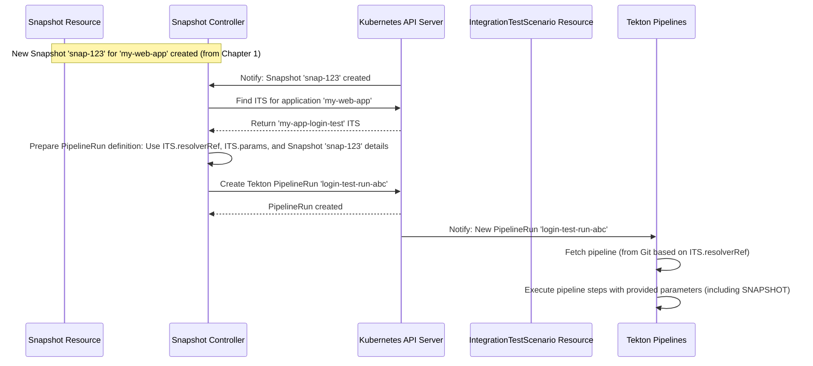

# Chapter 2: IntegrationTestScenario

In [Chapter 1: Snapshot](01_snapshot_.md), we learned how the `integration-service` captures a "photo" or **Snapshot** of your application's components right after a build. This Snapshot gives us a fixed, reliable set of component versions.

That's great! But now, how do we actually *test* this specific Snapshot? If our application `my-web-app` has a `frontend` and a `backend`, maybe we have a special test that checks if the login flow between them works correctly. How do we tell the `integration-service` to run *that specific test* against the components listed in our new Snapshot?

This is where the **IntegrationTestScenario** comes in.

## What is an IntegrationTestScenario?

Think of an **IntegrationTestScenario** (ITS) as a **recipe card for running a specific integration test**. Just like a recipe card tells you:

*   **What dish to make:** Which test to run (e.g., "login-flow-test").
*   **Where to find the instructions:** Which Tekton pipeline contains the steps for this test.
*   **Special ingredients needed:** What parameters (like configuration settings or test data locations) the pipeline needs.
*   **(Optional) When to use this recipe:** Under what conditions this test should run (e.g., only for changes pushed to the `main` branch).

You, the user, define these "recipe cards" for each application. When a new [Snapshot](01_snapshot_.md) is created, the `integration-service` looks for relevant IntegrationTestScenario recipes for that application and uses them to run the tests.

## Why Do We Need IntegrationTestScenarios?

They solve several key problems:

1.  **Defining *How* to Test:** A [Snapshot](01_snapshot_.md) just lists component versions. The `IntegrationTestScenario` tells the system *what* testing logic (which pipeline) to execute against those versions.
2.  **Reusability:** You can define standard test pipelines (like smoke tests, full regression tests) and reuse them across different applications or trigger conditions just by creating different `IntegrationTestScenario` resources pointing to the same pipeline.
3.  **Configuration:** Allows passing specific parameters to your test pipeline, making tests flexible (e.g., testing against different database configurations).
4.  **Control:** Lets you specify *when* certain tests should run using contexts (though we'll keep this simple for now).

## Anatomy of an IntegrationTestScenario

Let's look at the key parts defined in the `spec` (specification) of an `IntegrationTestScenario`. We'll use the `v1beta2` version, which is the latest stable version.

*   **`application` (Required):** Links this test scenario to a specific application (e.g., `my-web-app`). This tells the system, "This recipe is for the `my-web-app` cake."
*   **`resolverRef` (Required):** Specifies *where* to find the Tekton pipeline that defines the test steps. This is like telling the system where the instruction manual (the pipeline) is located.
    *   `resolver`: The type of location (e.g., `git` for a Git repository, `bundle` for a Tekton bundle image).
    *   `params`: Details needed by the resolver. For `git`, common params are:
        *   `url`: The Git repository URL (e.g., `https://github.com/my-org/my-app-tests.git`).
        *   `revision`: The branch or commit hash (e.g., `main`).
        *   `pathInRepo`: The path to the pipeline definition file within the repository (e.g., `pipelines/login-test.yaml`).
*   **`params` (Optional):** A list of extra parameters to pass directly *to the Tekton pipeline* when it runs. These are the "special ingredients" for your recipe. For example:
    *   `name: TEST_MODE`, `value: smoke`
    *   `name: CONFIG_FILE`, `value: /configs/staging.yaml`
    *   **Important:** The system automatically adds a parameter named `SNAPSHOT` containing the details of the [Snapshot](01_snapshot_.md) being tested. You don't need to add this one manually!
*   **`contexts` (Optional):** Defines specific conditions under which this scenario should be considered active. For example, you might only want a test to run on pushes to the main branch. (We'll skip the details for now, but know it's there for more advanced control).

## How to Use It: An Example

Imagine we want to define a basic integration test for our `my-web-app`. The test logic is defined in a Tekton pipeline located in a Git repository.

Here's how we would define the `IntegrationTestScenario` as a Kubernetes resource (usually in a YAML file):

```yaml
# file: my-app-login-test-scenario.yaml
apiVersion: appstudio.redhat.com/v1beta2 # Use the v1beta2 API
kind: IntegrationTestScenario
metadata:
  name: my-app-login-test # A unique name for this scenario
  namespace: my-dev-namespace # Must be in the same namespace as the Application
spec:
  application: my-web-app # Which application this tests
  resolverRef: # Where to find the test pipeline definition
    resolver: git # The pipeline is in a Git repository
    params:
      - name: url # The repository URL
        value: https://github.com/my-org/my-app-tests.git
      - name: revision # Use the main branch
        value: main
      - name: pathInRepo # Path to the pipeline file in the repo
        value: tekton/pipelines/login-flow-test.yaml
  params: # Extra parameters for the pipeline itself
    - name: test-user-credentials # Parameter name expected by the pipeline
      value: "test-user-secret" # Value (e.g., name of a K8s Secret)
    - name: target-url-suffix # Another parameter for the pipeline
      value: ".test.example.com"
# Status section is updated automatically by the system
```

*   **Explanation:**
    *   This defines a scenario named `my-app-login-test` for the `my-web-app` application in the `my-dev-namespace`.
    *   It tells the system to find the test pipeline using the `git` resolver.
    *   The pipeline definition is located at `tekton/pipelines/login-flow-test.yaml` in the `main` branch of the `https://github.com/my-org/my-app-tests.git` repository.
    *   When this pipeline runs, it will receive two extra parameters: `test-user-credentials` (with value `test-user-secret`) and `target-url-suffix` (with value `.test.example.com`).
    *   Crucially, it will *also* automatically receive the `SNAPSHOT` parameter containing the JSON representation of the [Snapshot](01_snapshot_.md) being tested.

Now, when a new [Snapshot](01_snapshot_.md) for `my-web-app` is created, the system will find this `IntegrationTestScenario`, fetch the `login-flow-test.yaml` pipeline from Git, and start a Tekton `PipelineRun` using that pipeline, passing in the `SNAPSHOT` details and the extra parameters we defined.

## Under the Hood: How Scenarios are Used

The `IntegrationTestScenario` resource itself is mostly just data – a definition. The real action happens when a [Snapshot](01_snapshot_.md) is created.

1.  **Snapshot Created:** As discussed in [Chapter 1: Snapshot](01_snapshot_.md), a new `Snapshot` resource appears in Kubernetes for `my-web-app`.
2.  **Snapshot Controller Watches:** The [Snapshot Controller](04_snapshot_controller_.md) (which we'll cover in detail later) sees this new Snapshot.
3.  **Find Scenarios:** The controller queries the Kubernetes API: "Find all `IntegrationTestScenario` resources in the same namespace (`my-dev-namespace`) whose `spec.application` is `my-web-app`." It finds our `my-app-login-test` scenario.
4.  **Prepare PipelineRun:** For each scenario found, the controller prepares to create a Tekton `PipelineRun`. It uses the `resolverRef` to tell Tekton where to find the pipeline (`login-flow-test.yaml` in our Git repo).
5.  **Inject Parameters:** It gathers the parameters:
    *   The `SNAPSHOT` parameter (automatically generated, contains the Snapshot JSON).
    *   Any parameters defined in `spec.params` of the `IntegrationTestScenario` (`test-user-credentials`, `target-url-suffix`).
6.  **Create PipelineRun:** The controller creates the Tekton `PipelineRun` resource in Kubernetes, pointing to the pipeline and including all the parameters.
7.  **Tekton Executes:** Tekton picks up the `PipelineRun` and executes the test steps defined in `login-flow-test.yaml`.

Here's a simplified diagram showing the flow when a Snapshot triggers tests via a Scenario:



## Diving Deeper into the Code

Let's look at where `IntegrationTestScenario` is defined and handled.

### Defining the Structure (`integrationtestscenario_types.go`)

The structure of the `IntegrationTestScenario` resource is defined in Go code, which is then used to generate the Kubernetes Custom Resource Definition (CRD).

```go
// Simplified from api/v1beta2/integrationtestscenario_types.go

package v1beta2

import (
	metav1 "k8s.io/apimachinery/pkg/apis/meta/v1"
)

// IntegrationTestScenarioSpec defines the desired state of IntegrationScenario
type IntegrationTestScenarioSpec struct {
	// Application that's associated with the IntegrationTestScenario
	// +required
	Application string `json:"application"`

	// Tekton Resolver reference to find the pipeline
	// +required
	ResolverRef ResolverRef `json:"resolverRef"`

	// Params to pass to the pipeline
	Params []PipelineParameter `json:"params,omitempty"`

	// Contexts where this IntegrationTestScenario can be applied
	Contexts []TestContext `json:"contexts,omitempty"`
}

// Tekton Resolver reference details
// +required
type ResolverRef struct {
	// Resolver type, e.g., "git", "bundle"
	// +required
	Resolver string `json:"resolver"`

	// Parameters for the resolver (e.g., url, revision, pathInRepo for git)
	// +required
	Params []ResolverParameter `json:"params"`
    // ... other optional fields like ResourceKind
}

// Parameter for the resolver
type ResolverParameter struct {
	Name  string `json:"name"`
	Value string `json:"value"`
}

// Parameter to pass to the pipeline itself
type PipelineParameter struct {
	Name   string   `json:"name"`
	Value  string   `json:"value,omitempty"` // Single value
	Values []string `json:"values,omitempty"` // Or multiple values (array)
}

// +kubebuilder:object:root=true
// +kubebuilder:storageversion // Indicates this is the preferred version

// IntegrationTestScenario is the Schema for the integrationtestscenarios API
type IntegrationTestScenario struct {
	metav1.TypeMeta   `json:",inline"`
	metav1.ObjectMeta `json:"metadata,omitempty"`

	Spec   IntegrationTestScenarioSpec   `json:"spec,omitempty"`
	Status IntegrationTestScenarioStatus `json:"status,omitempty"` // Status gets filled by controllers
}

// ... other definitions for Status, Contexts etc. ...

func init() {
	// Registers this Go type with the Kubernetes machinery
	SchemeBuilder.Register(&IntegrationTestScenario{}, &IntegrationTestScenarioList{})
}
```

*   **Explanation:** This Go code defines the `IntegrationTestScenario` struct, mirroring the YAML structure we saw earlier. It includes the key fields like `Application`, `ResolverRef`, and `Params`. Annotations like `+required` enforce validation rules. This definition is the blueprint used by Kubernetes.

### Validation (`integrationtestscenario_webhook.go`)

Before an `IntegrationTestScenario` is even saved to the cluster, a webhook can validate it to catch errors early.

```go
// Simplified concept from api/v1beta2/integrationtestscenario_webhook.go

// ValidateCreate checks the IntegrationTestScenario when it's created.
func (r *IntegrationTestScenario) ValidateCreate() (warnings admission.Warnings, err error) {
	// Check if the name is valid (DNS-1035 format)
	if len(validation.IsDNS1035Label(r.Name)) != 0 {
		return nil, field.Invalid(field.NewPath("metadata").Child("name"), r.Name,
			"IntegrationTestScenario name is invalid...")
	}

	// Don't allow manually specifying the SNAPSHOT parameter
	for _, param := range r.Spec.Params {
		if param.Name == "SNAPSHOT" {
			return nil, field.Invalid(field.NewPath("Spec").Child("Params"), param.Name,
				"'SNAPSHOT' param is reserved and set automatically.")
		}
	}

	// Specific validation for git resolver parameters
	if r.Spec.ResolverRef.Resolver == "git" {
		var paramErrors error
		// ... logic to check if 'url' and 'repo'+'org' params conflict ...
        // ... logic to validate URL format using validateUrl function ...
		if paramErrors != nil {
			return nil, paramErrors
		}
	}

	return nil, nil
}

// validateUrl checks if a string is a valid https URL
func validateUrl(key, url string) error {
	// ... uses net/url.ParseRequestURI and checks for "https://" prefix ...
	return nil // or error if invalid
}
```

*   **Explanation:** This webhook performs checks like ensuring the name format is correct, preventing users from manually adding the reserved `SNAPSHOT` parameter, and validating parameters specific to the chosen resolver (like checking Git URL formats). This helps ensure only valid scenarios are created.

### Scenario Controller (`scenario_controller.go` and `scenario_adapter.go`)

There's also a controller specifically for the `IntegrationTestScenario` resource itself. **Important:** This controller *does not* run the tests. Its main job is to ensure the scenario is valid *after* creation and linked correctly to its Application.

```go
// Simplified from internal/controller/scenario/scenario_controller.go

// Reconcile handles changes to IntegrationTestScenario resources
func (r *Reconciler) Reconcile(ctx context.Context, req ctrl.Request) (ctrl.Result, error) {
	// ... Fetch the IntegrationTestScenario object ...
	scenario := &v1beta2.IntegrationTestScenario{}
	// ... handle errors ...

	// Get the Application referenced in the scenario's spec
	application, err := r.getApplicationFromScenario(ctx, scenario)
	if err != nil {
        // If Application not found, mark scenario as invalid
		logger.Error(err, "Failed to get Application from Scenario")
		// ... update scenario status to invalid ...
		return ctrl.Result{}, nil // Stop processing
	}

	// Create an adapter to perform actions
	adapter := NewAdapter(ctx, application, scenario, logger, loader, r.Client)

	// Run operations like ensuring owner references are set
	return controller.ReconcileHandler([]controller.Operation{
		adapter.EnsureCreatedScenarioIsValid,
	})
}

// getApplicationFromScenario finds the Application resource
func (r *Reconciler) getApplicationFromScenario(ctx context.Context, scenario *v1beta2.IntegrationTestScenario) (*applicationapiv1alpha1.Application, error) {
	// ... Use r.Get to find Application by name and namespace ...
}
```

```go
// Simplified from internal/controller/scenario/scenario_adapter.go

// EnsureCreatedScenarioIsValid makes sure the scenario is linked to its application
func (a *Adapter) EnsureCreatedScenarioIsValid() (controller.OperationResult, error) {
    // Check if the Scenario is being deleted, if so, do nothing
	if a.scenario.DeletionTimestamp != nil {
		return controller.ContinueProcessing()
	}

	// Ensure the Application is set as the owner of the Scenario
	// This helps with garbage collection and organization
	if a.scenario.OwnerReferences == nil {
		patch := client.MergeFrom(a.scenario.DeepCopy())
		// Set Application as the controller reference
		err := ctrl.SetControllerReference(a.application, a.scenario, a.client.Scheme())
		// ... handle error ...
		// Patch the Scenario object to add the owner reference
		err = a.client.Patch(a.context, a.scenario, patch)
		// ... handle error ...
	}

    // Update the Scenario's status to indicate it's valid
	if !meta.IsStatusConditionTrue(a.scenario.Status.Conditions, h.IntegrationTestScenarioValid) {
        patch := client.MergeFrom(a.scenario.DeepCopy())
		h.SetScenarioIntegrationStatusAsValid(a.scenario, "IntegrationTestScenario is Valid.")
		err := a.client.Status().Patch(a.context, a.scenario, patch)
        // ... handle error ...
		a.logger.LogAuditEvent("IntegrationTestScenario marked as Valid", a.scenario, h.LogActionUpdate)
    }

	return controller.ContinueProcessing()
}
```

*   **Explanation:** The `scenario_controller.go` watches for `IntegrationTestScenario` resources. When one is found, it verifies the referenced `Application` exists. The `EnsureCreatedScenarioIsValid` function in the adapter then ensures the `Application` is set as the "owner" of the scenario (useful for cleanup) and updates the scenario's status to show it's valid and ready to be used (by the [Snapshot Controller](04_snapshot_controller_.md)).

## Conclusion

You've now learned about the **IntegrationTestScenario**! It's the crucial "recipe card" that you define to tell the `integration-service` *how* to test a specific [Snapshot](01_snapshot_.md) of your application. You specify which application it's for, where to find the test pipeline (using `resolverRef`), and any extra parameters (`params`) the pipeline needs.

While the Scenario Controller ensures the recipe card itself is valid, the actual "cooking" – triggering the tests based on the scenario when a Snapshot arrives – is handled by the [Snapshot Controller](04_snapshot_controller_.md), which we'll explore later.

We've seen how Snapshots capture the *state* and Scenarios define the *tests*. Next, let's start looking at the "engines" or controllers that watch for events and make things happen, beginning with the one that kicks off this whole process after a build completes.

Let's move on to [Chapter 3: Build Pipeline Controller](03_build_pipeline_controller_.md) to understand how the system reacts to finished builds.

---

Generated by [AI Codebase Knowledge Builder](https://github.com/The-Pocket/Tutorial-Codebase-Knowledge)