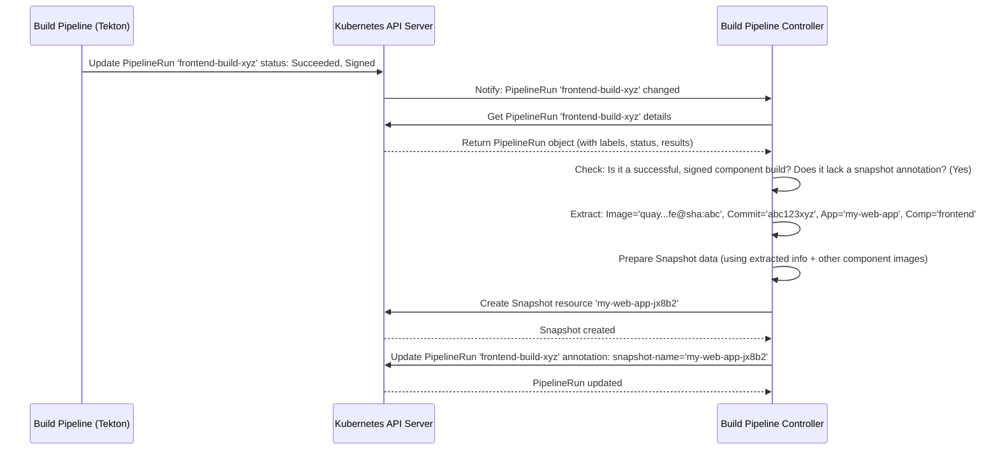

# Chapter 3: Build Pipeline Controller

In [Chapter 1: Snapshot](01_snapshot_.md), we learned about Snapshots – the "photographs" capturing the exact state of all our application's components. In [Chapter 2: IntegrationTestScenario](02_integrationtestscenario_.md), we saw how to define the "recipes" (test pipelines) that should run against these Snapshots.

But how does a Snapshot actually get created right after a component is built? What connects the finished build process to the creation of that vital Snapshot record?

Meet the **Build Pipeline Controller**.

## What is the Build Pipeline Controller?

Imagine your application components are being built on an assembly line (using a tool called Tekton). Each time a component (like your `frontend` UI) is successfully assembled (built into a container image), it reaches the end of the line.

The **Build Pipeline Controller (BPC)** is like the **Quality Control Inspector** stationed right there. Its job is to:

1.  **Watch:** Keep an eye out for *finished* assembly jobs (Tekton `PipelineRun`s) that were specifically for building one of your application's components.
2.  **Inspect:** Check if the assembly job was successful. Did the component build without errors? Does it have the necessary quality stamps (like a security signature)?
3.  **Record:** If everything looks good, gather the important details:
    *   Which specific application and component was built? (`my-web-app`, `frontend`)
    *   What's the exact, unique identifier of the resulting part? (The container image URL with its digest, like `quay.io/myorg/frontend@sha256:abc...`)
    *   What blueprint version was used? (The source code commit ID, like `git commit abc123xyz`)
4.  **Certify:** Create the official record – the [Snapshot](01_snapshot_.md) – containing all these details, plus information about the other components of the application.

Without the Build Pipeline Controller, a finished build would just sit there. The BPC is the crucial link that notices the completed work and triggers the creation of the Snapshot, which in turn enables testing and potential releases.

## How Does it Work?

The Build Pipeline Controller is a piece of software running inside your Kubernetes cluster, constantly watching for changes.

1.  **Build Finishes:** A developer pushes code for the `frontend` component. A Tekton `PipelineRun` starts, builds the code, creates a container image (`quay.io/myorg/frontend@sha256:abc...`), pushes it, and marks itself as "Finished" and "Successful" in Kubernetes. It might also get digitally signed by another tool (Tekton Chains) for security.
2.  **BPC Notices:** The Build Pipeline Controller, which is watching all `PipelineRun` resources, sees this change.
3.  **BPC Checks:** It looks at the `PipelineRun`'s labels and annotations (metadata attached to it) to confirm:
    *   Is this a build `PipelineRun` for a known component (e.g., does it have a `appstudio.openshift.io/component: frontend` label)?
    *   Did it succeed? (Checks the `status` field).
    *   Is it signed? (Checks for an annotation like `chains.tekton.dev/signed: true`).
    *   Has a [Snapshot](01_snapshot_.md) already been created for this *exact* build? (Checks for an annotation like `test.appstudio.openshift.io/snapshot-name: my-web-app-jx8b2`). If yes, its job is done for this build.
4.  **BPC Gathers Info:** If all checks pass and no Snapshot exists yet, it extracts:
    *   Application (`my-web-app`) and Component (`frontend`) names from labels.
    *   The precise image URL + digest (e.g., `quay.io/myorg/frontend@sha256:abc...`) from the `PipelineRun` results.
    *   The source code Git commit hash (e.g., `abc123xyz`) from the `PipelineRun` parameters or results.
5.  **BPC Creates Snapshot:** It uses this information, along with the latest known images for *other* components (`backend`, `database`) of the `my-web-app`, to construct and create a new [Snapshot](01_snapshot_.md) resource in Kubernetes.
6.  **BPC Updates Build:** It usually adds an annotation to the original build `PipelineRun` (e.g., `test.appstudio.openshift.io/snapshot-name: my-web-app-jx8b2`) to mark that a Snapshot has been created for it, preventing duplicate work.

## Under the Hood: Watching and Reacting

Let's visualize the main flow:



This sequence shows the BPC reacting to the finished build, verifying it, gathering data, and creating the Snapshot resource via the Kubernetes API.

### Diving Deeper into the Code

The logic resides within the `integration-service`.

**1. The Controller Loop (`buildpipeline_controller.go`)**

Like many Kubernetes controllers, the BPC has a `Reconcile` function that gets called whenever a `PipelineRun` it's watching changes.

```go
// Simplified from internal/controller/buildpipeline/buildpipeline_controller.go

// Reconcile is called when a PipelineRun changes
func (r *Reconciler) Reconcile(ctx context.Context, req ctrl.Request) (ctrl.Result, error) {
	logger := // ... setup logger ...
	loader := // ... setup loader ...

	// 1. Get the PipelineRun object that triggered the event
	pipelineRun := &tektonv1.PipelineRun{}
	err := r.Get(ctx, req.NamespacedName, pipelineRun)
	// ... handle errors (e.g., if not found) ...

	// 2. Check if it's a build for a known Component
	component, err := loader.GetComponentFromPipelineRun(ctx, r.Client, pipelineRun)
	// ... handle errors or if component label is missing ...

	// 3. Get the Application associated with the Component
	application, err := loader.GetApplicationFromComponent(ctx, r.Client, component)
	// ... handle errors ...

	// 4. Create an 'Adapter' to handle the specific logic for this PipelineRun
	adapter := NewAdapter(ctx, pipelineRun, component, application, logger, loader, r.Client)

	// 5. Run the sequence of operations defined in the adapter
	return controller.ReconcileHandler([]controller.Operation{
		adapter.EnsurePipelineIsFinalized, // Add cleanup finalizer if needed
		adapter.EnsurePRGroupAnnotated, // Add PR info if it's a PR build
		adapter.EnsureIntegrationTestReportedToGitProvider, // Report status (more in later chapters)
		adapter.EnsureSnapshotExists, // THE CORE LOGIC: Create Snapshot if needed
	})
}
```

*   **Explanation:** The `Reconcile` function fetches the `PipelineRun` that changed, finds its associated `Component` and `Application`, and then delegates the core logic to an `Adapter`. The key operation for us is `EnsureSnapshotExists`.

**2. Checking the Build and Creating the Snapshot (`buildpipeline_adapter.go`)**

The `EnsureSnapshotExists` function within the adapter contains the main logic.

```go
// Simplified from internal/controller/buildpipeline/buildpipeline_adapter.go

// EnsureSnapshotExists creates a Snapshot if conditions are met.
func (a *Adapter) EnsureSnapshotExists() (result controller.OperationResult, err error) {
	// ... setup deferred function to update PLR annotations/finalizers at the end ...

	// Check 1: Did the pipeline succeed?
	if !h.HasPipelineRunSucceeded(a.pipelineRun) {
		a.logger.Info("PipelineRun did not succeed, skipping Snapshot creation.")
		// ... handle cleanup/finalizers for failed runs ...
		return controller.ContinueProcessing() // Nothing more to do here
	}

	// Check 2: Is it signed? (Check for a specific annotation)
	if _, found := a.pipelineRun.ObjectMeta.Annotations[tekton.PipelineRunChainsSignedAnnotation]; !found {
		a.logger.Info("PipelineRun is not signed yet, waiting.")
		return controller.ContinueProcessing() // Wait for signature
	}

	// Check 3: Does it already have a Snapshot annotation?
	if _, found := a.pipelineRun.ObjectMeta.Annotations[tekton.SnapshotNameLabel]; found {
		a.logger.Info("PipelineRun already associated with a Snapshot.")
		// ... mark for finalizer removal ...
		return controller.ContinueProcessing() // Already processed
	}

	// Check 4: Double-check if a Snapshot resource already exists (maybe annotation failed)
	existingSnapshots, _ := a.loader.GetAllSnapshotsForBuildPipelineRun(a.context, a.client, a.pipelineRun)
	if len(*existingSnapshots) > 0 {
		a.logger.Info("Found existing Snapshot resource for this PipelineRun.")
		// ... try to add annotation if missing ...
		return controller.ContinueProcessing()
	}

	// --- All checks passed, let's create a Snapshot! ---

	// 1. Prepare the Snapshot data structure
	expectedSnapshot, err := a.prepareSnapshotForPipelineRun(a.pipelineRun, a.component, a.application)
	if err != nil {
		a.logger.Error(err, "Failed to prepare Snapshot data")
		// ... handle specific errors, update PLR status ...
		return controller.RequeueWithError(err)
	}

	// 2. Create the Snapshot resource in Kubernetes
	err = a.client.Create(a.context, expectedSnapshot)
	if err != nil {
		a.logger.Error(err, "Failed to create Snapshot resource")
		// ... handle specific errors (like quota exceeded) ...
		return controller.RequeueWithError(err)
	}
	a.logger.LogAuditEvent("Created new Snapshot", expectedSnapshot, h.LogActionAdd)

	// 3. Annotate the original PipelineRun with the new Snapshot name
	err = a.annotateBuildPipelineRunWithSnapshot(expectedSnapshot)
	// ... handle annotation error ...

	// ... mark for finalizer removal ...
	return controller.ContinueProcessing()
}

// prepareSnapshotForPipelineRun gathers info and uses gitops.PrepareSnapshot
func (a *Adapter) prepareSnapshotForPipelineRun(pipelineRun *tektonv1.PipelineRun, component *applicationapiv1alpha1.Component, application *applicationapiv1alpha1.Application) (*applicationapiv1alpha1.Snapshot, error) {

	// Get image URL + Digest from PipelineRun results
	newContainerImage, err := a.getImagePullSpecFromPipelineRun(pipelineRun)
	// ... handle error ...

	// Get source commit info from PipelineRun results/params
	componentSource, err := a.getComponentSourceFromPipelineRun(pipelineRun)
	// ... handle error ...

	// Get all components for the application
	applicationComponents, err := a.loader.GetAllApplicationComponents(a.context, a.client, application)
	// ... handle error ...

	// Call the function (covered in Chapter 1) to assemble the Snapshot data
	snapshot, err := gitops.PrepareSnapshot(a.context, a.client, application, applicationComponents, component, newContainerImage, componentSource)
	// ... handle error ...

	// Copy relevant labels/annotations from PipelineRun to Snapshot
	// ... logic to copy metadata ...
	snapshot.Labels[gitops.BuildPipelineRunNameLabel] = pipelineRun.Name // Link back to build

	return snapshot, nil
}

// getImagePullSpecFromPipelineRun extracts image digest from results.
func (a *Adapter) getImagePullSpecFromPipelineRun(pipelineRun *tektonv1.PipelineRun) (string, error) {
	outputImage, err := tekton.GetOutputImage(pipelineRun) // e.g., quay.io/myorg/frontend:latest
	imageDigest, err := tekton.GetOutputImageDigest(pipelineRun) // e.g., sha256:abc...
	// ... handle errors ...
	// Combine to form quay.io/myorg/frontend@sha256:abc...
	return fmt.Sprintf("%s@%s", strings.Split(outputImage, ":")[0], imageDigest), nil
}

// getComponentSourceFromPipelineRun extracts commit info.
func (a *Adapter) getComponentSourceFromPipelineRun(pipelineRun *tektonv1.PipelineRun) (*applicationapiv1alpha1.ComponentSource, error) {
	// ... logic to get git url and commit hash from pipelineRun params/results ...
	componentSource := // ... create ComponentSource struct ...
	return &componentSource, nil
}

// annotateBuildPipelineRunWithSnapshot adds the snapshot name annotation.
func (a *Adapter) annotateBuildPipelineRunWithSnapshot(snapshot *applicationapiv1alpha1.Snapshot) error {
	// ... logic using a.client.Patch to add the annotation ...
	return nil
}
```

*   **Explanation:** The code first performs several checks (success, signed, existing Snapshot annotation/resource). If all checks pass, it calls helper functions (`getImagePullSpecFromPipelineRun`, `getComponentSourceFromPipelineRun`) to extract the necessary details from the `PipelineRun`. It then calls the `gitops.PrepareSnapshot` function (which we saw briefly in Chapter 1) to assemble the data for the new Snapshot. Finally, it uses the Kubernetes client (`a.client.Create`) to create the Snapshot resource and then (`annotateBuildPipelineRunWithSnapshot`) updates the build `PipelineRun` to link it to the newly created Snapshot.

### Handling Pull Requests

The controller also has logic (`EnsurePRGroupAnnotated`) to identify builds triggered by pull requests (PRs). It adds special labels and annotations related to the PR (like the source branch name) to both the build `PipelineRun` and subsequently to the generated [Snapshot](01_snapshot_.md). This information is useful later for potentially grouping related Snapshots together (e.g., testing multiple components changed in the same PR) and for reporting status back to the PR.

## Conclusion

You've learned about the **Build Pipeline Controller**, the essential "Quality Control Inspector" of the `integration-service`. It watches for successfully completed and signed component builds (Tekton `PipelineRun`s). When it finds one, it meticulously gathers the build output details (image digest, commit hash) and creates a [Snapshot](01_snapshot_.md) resource, officially recording the state of the application at that moment. This controller acts as the critical trigger that connects the build system to the integration testing process.

Now that we know how a build completion leads to a Snapshot being created, what happens *next*? What picks up this new Snapshot and decides which tests to run based on the [IntegrationTestScenario](02_integrationtestscenario_.md) definitions?

Let's move on to [Chapter 4: Snapshot Controller](04_snapshot_controller_.md) to find out!

---

Generated by [AI Codebase Knowledge Builder](https://github.com/The-Pocket/Tutorial-Codebase-Knowledge)