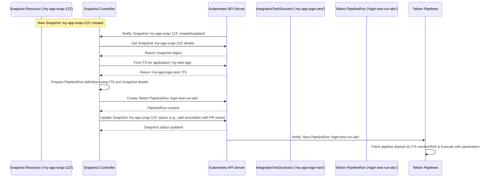

# Chapter 4: Snapshot Controller

Welcome back! In [Chapter 3: Build Pipeline Controller](03_build_pipeline_controller_.md), we saw how the system automatically creates a [Snapshot](01_snapshot_.md) – a detailed "photo" – whenever a component of our application is successfully built. We also learned in [Chapter 2: IntegrationTestScenario](02_integrationtestscenario_.md) how to define "recipes" (IntegrationTestScenarios) that specify *which* tests should run for our application.

Now, we have a fresh Snapshot and a set of test recipes. But who actually looks at the new Snapshot, finds the right recipes, and says, "Okay, time to start cooking!" – I mean, testing?

This is the job of the **Snapshot Controller**.

## What is the Snapshot Controller?

Imagine you're the manager of a test kitchen. Cooks (like the [Build Pipeline Controller](03_build_pipeline_controller_.md)) bring you newly prepared ingredients, perfectly measured and documented on an ingredient list (our [Snapshot](01_snapshot_.md)). You also have a big binder full of recipe cards ([IntegrationTestScenario](02_integrationtestscenario_.md)s) for different dishes.

The **Snapshot Controller** is like that **Test Kitchen Manager**. Its responsibilities are:

1.  **Notice New Arrivals:** It constantly watches for new ingredient lists (Snapshots) arriving in the kitchen. It also notices if someone asks to re-run a test for an existing list.
2.  **Find the Right Recipes:** When a new list arrives (a Snapshot is created for `my-web-app`), it goes to the recipe binder and finds all the recipe cards ([IntegrationTestScenario](02_integrationtestscenario_.md)s) specifically designed for `my-web-app`.
3.  **Assign Tasks:** For each matching recipe card, it tells a chef (Tekton, the pipeline execution engine) to start cooking *that specific recipe* using *exactly* the ingredients listed on the new list (Snapshot).
4.  **Pass Special Instructions:** It makes sure the chef gets any special instructions from the recipe card (parameters defined in the `IntegrationTestScenario`) *and* the ingredient list itself (the Snapshot details).

In short, the Snapshot Controller is the **test coordinator**. It connects the state captured in a Snapshot with the test definitions in IntegrationTestScenarios, kicking off the actual integration testing process.

## How Does it Work?

The Snapshot Controller, like the Build Pipeline Controller, runs inside your Kubernetes cluster, watching for specific events.

1.  **Snapshot Appears:** A new [Snapshot](01_snapshot_.md) resource, say `my-app-snap-123`, is created in Kubernetes (triggered by the [Build Pipeline Controller](03_build_pipeline_controller_.md) after a build, as we saw in Chapter 3).
2.  **Snapshot Controller Notices:** The Snapshot Controller sees this new `Snapshot` resource.
3.  **Find Application:** It reads the `spec.application` field from the Snapshot (`my-web-app`).
4.  **Find Scenarios:** It asks Kubernetes: "Show me all `IntegrationTestScenario` resources in the same namespace that have `spec.application: my-web-app`." Let's say it finds one named `my-app-login-test` (from Chapter 2).
5.  **Check Scenario Applicability:** It checks if the `my-app-login-test` scenario is valid and applicable to this specific Snapshot (e.g., based on optional `contexts` in the scenario). Let's assume it is.
6.  **Prepare PipelineRun:** The controller prepares to create a Tekton `PipelineRun` (the instruction to run a pipeline). It uses the `resolverRef` from the `my-app-login-test` scenario to tell Tekton where to find the pipeline definition (e.g., in a Git repository).
7.  **Inject Parameters:** It gathers the parameters for the `PipelineRun`:
    *   The special `SNAPSHOT` parameter, containing the JSON details of `my-app-snap-123`.
    *   Any parameters defined in the `my-app-login-test` scenario's `spec.params` (like `test-user-credentials`).
8.  **Create PipelineRun:** The controller creates the Tekton `PipelineRun` resource in Kubernetes. Let's call it `login-test-run-abc`.
9.  **Tekton Executes:** Tekton sees the new `PipelineRun` and starts executing the steps defined in the pipeline, using the provided parameters (including the crucial `SNAPSHOT` data).
10. **Update Snapshot Status:** The Snapshot Controller often updates the original `Snapshot` resource (e.g., adding an annotation or status condition) to indicate that testing has started or to record the name of the `PipelineRun` (`login-test-run-abc`) created for a specific scenario (`my-app-login-test`).

## Under the Hood: Watching and Triggering Tests

Let's visualize this flow:



This shows the controller reacting to the Snapshot, finding the right test scenario, creating the Tekton PipelineRun, updating the Snapshot's status, and letting Tekton take over the execution.

### Diving Deeper into the Code

The core logic for this controller lives in `internal/controller/snapshot/`.

**1. Watching for Changes (`snapshot_controller.go` and `snapshot_predicate.go`)**

The controller needs to know *when* to act. It doesn't react to every tiny change in a Snapshot. It uses **predicates** to filter events.

```go
// Simplified from gitops/snapshot_predicate.go

// IntegrationSnapshotChangePredicate filters events for starting tests.
func IntegrationSnapshotChangePredicate() predicate.Predicate {
	return predicate.Funcs{
		CreateFunc: func(e event.CreateEvent) bool {
			// Yes, react when a new Snapshot is created
			return true
		},
		UpdateFunc: func(e event.UpdateEvent) bool {
			// Only react if the 'testing finished' status *changes*
			// (This is more for reporting, less for starting tests)
			return HasSnapshotTestingChangedToFinished(e.ObjectOld, e.ObjectNew)
		},
		// ... other functions return false ...
	}
}

// SnapshotIntegrationTestRerunTriggerPredicate filters events for re-running tests.
func SnapshotIntegrationTestRerunTriggerPredicate() predicate.Predicate {
	return predicate.Funcs{
		UpdateFunc: func(e event.UpdateEvent) bool {
			// React ONLY if the special re-run label was just added or changed
			return HasSnapshotRerunLabelChanged(e.ObjectOld, e.ObjectNew)
		},
		// ... other functions return false ...
	}
}
```

*   **Explanation:** These predicates tell the controller framework to only call the main logic (`Reconcile`) if a *new* Snapshot is created (`IntegrationSnapshotChangePredicate`) OR if the special label (`test.appstudio.openshift.io/run`) used to request a test re-run is added or changed (`SnapshotIntegrationTestRerunTriggerPredicate`). This avoids unnecessary work.

**2. The Controller's Main Logic (`snapshot_controller.go`)**

The `Reconcile` function is the entry point when a relevant Snapshot event occurs.

```go
// Simplified from internal/controller/snapshot/snapshot_controller.go

// Reconcile handles incoming Snapshot events.
func (r *Reconciler) Reconcile(ctx context.Context, req ctrl.Request) (ctrl.Result, error) {
	logger := // ... setup logger ...
	loader := // ... setup loader ...

	// 1. Get the Snapshot object
	snapshot := &applicationapiv1alpha1.Snapshot{}
	err := r.Get(ctx, req.NamespacedName, snapshot)
	// ... handle errors (like not found) ...

	// 2. Get the Application referenced by the Snapshot
	application, err := loader.GetApplicationFromSnapshot(ctx, r.Client, snapshot)
	// ... handle errors (e.g., if Application is missing) ...
	// Mark Snapshot invalid if Application not found

	// 3. Ensure Snapshot has the Application as its owner (for cleanup)
	if !controllerutil.HasControllerReference(snapshot) {
		// ... logic to set owner reference ...
	}

	// 4. Create an Adapter to handle the specific logic for this Snapshot
	adapter := NewAdapter(ctx, snapshot, application, logger, loader, r.Client)

	// 5. Execute the sequence of operations defined in the adapter
	return controller.ReconcileHandler([]controller.Operation{
		// ... other operations like EnsureGroupSnapshotExist, EnsureAllReleasesExist ...
		adapter.EnsureRerunPipelineRunsExist,      // Handle explicit re-runs first
		adapter.EnsureIntegrationPipelineRunsExist, // Create initial PipelineRuns if needed
	})
}
```

*   **Explanation:** The `Reconcile` function fetches the `Snapshot` and its `Application`. It ensures they are linked correctly and then creates an `Adapter`. The adapter pattern helps organize the different tasks the controller might need to perform. The key operations for triggering tests are `EnsureRerunPipelineRunsExist` and `EnsureIntegrationPipelineRunsExist`.

**3. Creating the PipelineRuns (`snapshot_adapter.go`)**

The `EnsureIntegrationPipelineRunsExist` operation contains the logic to find scenarios and create the initial test runs.

```go
// Simplified from internal/controller/snapshot/snapshot_adapter.go

// EnsureIntegrationPipelineRunsExist creates PipelineRuns for applicable scenarios.
func (a *Adapter) EnsureIntegrationPipelineRunsExist() (controller.OperationResult, error) {
	// 1. Check if testing is already finished for this Snapshot
	if gitops.HaveAppStudioTestsFinished(a.snapshot) {
		a.logger.Info("Snapshot testing already finished.")
		return controller.ContinueProcessing()
	}

	// 2. Load all IntegrationTestScenarios defined for the Application
	allScenarios, _ := a.loader.GetAllIntegrationTestScenariosForApplication(a.context, a.client, a.application)
	if allScenarios == nil {
		a.logger.Info("No scenarios found for application.")
		// ... potentially mark snapshot as passed if no required tests exist ...
		return controller.ContinueProcessing()
	}

	// 3. Filter scenarios based on context (e.g., only run on 'push' events)
	applicableScenarios := gitops.FilterIntegrationTestScenariosWithContext(allScenarios, a.snapshot)
	a.logger.Info(fmt.Sprintf("Found %d applicable scenarios", len(*applicableScenarios)))

	// 4. Initialize/Load the test status tracking within the Snapshot annotation
	testStatuses, _ := gitops.NewSnapshotIntegrationTestStatusesFromSnapshot(a.snapshot)
	testStatuses.InitStatuses(scenariosNamesToList(applicableScenarios)) // Add entries for new scenarios
	// ... (save status back to snapshot later) ...

	// 5. Loop through applicable scenarios
	for _, scenario := range *applicableScenarios {
		scenario := scenario // Avoid closure issues
		// 5a. Check if scenario is marked valid
		if !h.IsScenarioValid(&scenario) {
			testStatuses.UpdateTestStatusIfChanged(scenario.Name, /* TestInvalid */ ...)
			continue
		}

		// 5b. Check if a PipelineRun is already recorded for this scenario in the status
		status, ok := testStatuses.GetScenarioStatus(scenario.Name)
		if ok && status.TestPipelineRunName != "" {
			a.logger.Info("PipelineRun already exists for scenario", "scenario", scenario.Name, "pipelineRun", status.TestPipelineRunName)
			continue // Already created, skip
		}

		// 5c. Create the Integration PipelineRun
		pipelineRun, err := a.createIntegrationPipelineRun(a.application, &scenario, a.snapshot)
		if err != nil {
			a.logger.Error(err, "Failed to create PipelineRun for scenario", "scenario", scenario.Name)
			testStatuses.UpdateTestStatusIfChanged(scenario.Name, /* TestInvalid */ ..., fmt.Sprintf("Failed: %s", err))
			// ... handle error properly (maybe retry?) ...
			continue
		}

		// 5d. Update the status tracking with the new PipelineRun name
		testStatuses.UpdateTestStatusIfChanged(scenario.Name, /* InProgress */ ..., fmt.Sprintf("PipelineRun '%s' created", pipelineRun.Name))
		testStatuses.UpdateTestPipelineRunName(scenario.Name, pipelineRun.Name)
	}

	// 6. Save the updated test statuses back to the Snapshot annotation
	err := gitops.WriteIntegrationTestStatusesIntoSnapshot(a.context, a.snapshot, testStatuses, a.client)
	// ... handle error ...

	// ... check if old pipeline runs need cancelling (for PRs) ...

	return controller.ContinueProcessing()
}
```

*   **Explanation:** This function first checks if tests are done. It then loads all [IntegrationTestScenario](02_integrationtestscenario_.md)s for the application and filters them. It uses a helper (`SnapshotIntegrationTestStatuses`) to keep track of which tests have run for which scenario *within the Snapshot's annotations*. For each applicable and valid scenario, it checks if a `PipelineRun` is already recorded in the status. If not, it calls `createIntegrationPipelineRun` and updates the status map. Finally, it saves the status map back to the Snapshot.

**4. The `createIntegrationPipelineRun` Helper (`snapshot_adapter.go`)**

This function actually builds and creates the Tekton `PipelineRun`.

```go
// Simplified from internal/controller/snapshot/snapshot_adapter.go

func (a *Adapter) createIntegrationPipelineRun(
	application *applicationapiv1alpha1.Application,
	scenario *v1beta2.IntegrationTestScenario,
	snapshot *applicationapiv1alpha1.Snapshot) (*tektonv1.PipelineRun, error) {

	a.logger.Info("Creating PipelineRun for scenario", "scenario", scenario.Name)

	// Use a builder to assemble the PipelineRun object
	pipelineRunBuilder := tekton.NewIntegrationPipelineRun(scenario.Name, application.Namespace, *scenario).
		WithSnapshot(snapshot). // Adds SNAPSHOT parameter
		WithIntegrationLabels(scenario).
		WithIntegrationAnnotations(scenario).
		WithApplication(a.application).
		WithExtraParams(scenario.Spec.Params). // Adds params from scenario spec
		WithFinalizer(h.IntegrationPipelineRunFinalizer)

	// Special handling for PRs: Update git resolver if source is the same repo/branch
	if shouldUpdateIntegrationTestGitResolver(scenario, snapshot) {
		pipelineRunBuilder.WithUpdatedTestsGitResolver(getGitResolverUpdateMap(snapshot))
	}

	pipelineRun := pipelineRunBuilder.AsPipelineRun()

	// Set the Snapshot as the "owner" of the PipelineRun
	err := ctrl.SetControllerReference(snapshot, pipelineRun, a.client.Scheme())
	if err != nil {
		return nil, fmt.Errorf("failed to set owner reference: %w", err)
	}

	// Create the PipelineRun resource in Kubernetes
	err = a.client.Create(a.context, pipelineRun)
	if err != nil {
		return nil, fmt.Errorf("failed to create PipelineRun: %w", err)
	}

	a.logger.LogAuditEvent("PipelineRun created", pipelineRun, h.LogActionAdd)

	// Mark Snapshot status as "In Progress" if it wasn't already
	if gitops.IsSnapshotNotStarted(a.snapshot) {
		// ... logic to update snapshot status condition ...
	}

	return pipelineRun, nil
}
```

*   **Explanation:** This helper uses a builder pattern (`tekton.NewIntegrationPipelineRun`) to construct the `PipelineRun` resource. It systematically adds the `SNAPSHOT` parameter, labels, annotations, parameters from the [IntegrationTestScenario](02_integrationtestscenario_.md), and a finalizer. It includes logic (`shouldUpdateIntegrationTestGitResolver`) to potentially override the Git source in the test pipeline if the test code lives in the same repository as the component being tested (useful for PRs). Finally, it sets the Snapshot as the owner (for Kubernetes garbage collection) and creates the `PipelineRun` using the client API.

**5. Handling Re-runs (`snapshot_adapter.go`)**

The `EnsureRerunPipelineRunsExist` operation (called before `EnsureIntegrationPipelineRunsExist`) specifically looks for the re-run label (`test.appstudio.openshift.io/run`) on the Snapshot.

```go
// Simplified concept from internal/controller/snapshot/snapshot_adapter.go EnsureRerunPipelineRunsExist

func (a *Adapter) EnsureRerunPipelineRunsExist() (controller.OperationResult, error) {
	// 1. Check if the re-run label exists on the snapshot
	runLabelValue, ok := gitops.GetIntegrationTestRunLabelValue(a.snapshot)
	if !ok {
		return controller.ContinueProcessing() // No re-run requested
	}

	// 2. Find the specific scenario(s) to re-run based on the label value ('all' or a specific scenario name)
	scenariosToRerun, _, err := a.getScenariosToRerun(runLabelValue)
	// ... handle errors, including scenario not found ...

	// 3. Load current test statuses
	testStatuses, _ := gitops.NewSnapshotIntegrationTestStatusesFromSnapshot(a.snapshot)

	// 4. Loop through scenarios to re-run
	skipCount := 0
	for _, scenario := range *scenariosToRerun {
		// 4a. Skip if test is already InProgress or Pending
		status, _ := testStatuses.GetScenarioStatus(scenario.Name)
		if status.Status == /* InProgress */ || status.Status == /* Pending */ {
			skipCount++
			continue
		}

		// 4b. Reset status and create a *new* PipelineRun for this scenario
		testStatuses.ResetStatus(scenario.Name)
		_, err := a.rerunIntegrationPipelinerunForScenario(&scenario, testStatuses) // Calls createIntegrationPipelineRun internally
		// ... handle error ...
	}

	// 5. Remove the re-run label from the snapshot
	err = gitops.RemoveIntegrationTestRerunLabel(a.context, a.client, a.snapshot)
	// ... handle error ...

	// 6. Save updated test statuses
	err = gitops.WriteIntegrationTestStatusesIntoSnapshot(a.context, a.snapshot, testStatuses, a.client)
	// ... handle error ...

	// 7. Reset overall Snapshot status conditions
	err = gitops.ResetSnapshotStatusConditions(a.context, a.client, a.snapshot, "Re-run initiated")
	// ... handle error ...

	return controller.ContinueProcessing()
}
```

*   **Explanation:** This operation specifically checks for the re-run label. If found, it identifies which scenarios need re-running. For each one (unless it's already running), it resets its status in the Snapshot's annotation and calls the same `createIntegrationPipelineRun` function to generate a *new* test run. After processing, it crucially removes the re-run label (so it doesn't trigger again) and updates the Snapshot status.

## Conclusion

The **Snapshot Controller** is the central coordinator for integration testing. It acts when a new [Snapshot](01_snapshot_.md) is ready or when a re-run is requested. It bridges the gap between the application's state (Snapshot) and the test definitions ([IntegrationTestScenario](02_integrationtestscenario_.md)) by finding the right scenarios and creating Tekton `PipelineRun`s to execute the tests. It also manages the status tracking of these tests directly within the Snapshot resource itself.

Now that the Snapshot Controller has created the `PipelineRun`s, who watches these `PipelineRun`s to see if the tests actually pass or fail? That's the job of our next controller.

Let's move on to [Chapter 5: Integration Pipeline Controller](05_integration_pipeline_controller_.md) to see how the results of these test runs are monitored.

---

Generated by [AI Codebase Knowledge Builder](https://github.com/The-Pocket/Tutorial-Codebase-Knowledge)