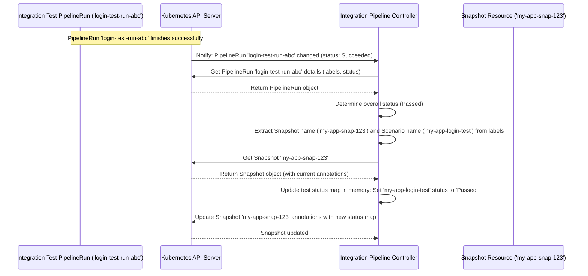

# Chapter 5: Integration Pipeline Controller

In [Chapter 4: Snapshot Controller](04_snapshot_controller_.md), we saw how the "Test Kitchen Manager" (Snapshot Controller) takes a new ingredient list ([Snapshot](01_snapshot_.md)) and the right recipe ([IntegrationTestScenario](02_integrationtestscenario_.md)) to tell the chef (Tekton) to start cooking – that is, to start running the integration test pipeline (Tekton `PipelineRun`).

Great! The tests are running. But how do we know what's happening? Is the test still running? Did it pass? Did it fail? Who keeps track of the results and updates the official record?

Meet the **Integration Pipeline Controller**.

## What is the Integration Pipeline Controller?

Imagine the test pipeline (Tekton `PipelineRun`) is like a mini-project or a game being played. The **Integration Pipeline Controller (IPC)** is like the dedicated **Scorekeeper** for that specific game. Its only job is to:

1.  **Watch the Game:** Keep a close eye on the specific test `PipelineRun`s that were started by the [Snapshot Controller](04_snapshot_controller_.md).
2.  **Track Progress:** Notice when the game starts, while it's in progress, and when it finally finishes.
3.  **Record the Score:** As the game progresses and especially when it ends, the scorekeeper finds the official scoreboard – which is our original [Snapshot](01_snapshot_.md) – and updates it with the current status (e.g., "Running", "Passed", "Failed").

So, while the [Snapshot Controller](04_snapshot_controller_.md) *starts* the tests, the **Integration Pipeline Controller** *monitors* them and *reports* their status back to the originating Snapshot.

## How Does it Work?

The Integration Pipeline Controller is another automated process running in your Kubernetes cluster.

1.  **Test Starts:** A Tekton `PipelineRun` for an integration test (let's call it `login-test-run-abc`) begins its execution. Kubernetes updates its status to "Running".
2.  **IPC Notices:** The Integration Pipeline Controller, which is specifically watching for `PipelineRun`s labeled as integration tests (it knows which ones because the [Snapshot Controller](04_snapshot_controller_.md) added labels like `test.appstudio.openshift.io/scenario: my-app-login-test`), sees this `login-test-run-abc` change.
3.  **IPC Checks Status:** It looks at the `PipelineRun`'s current status (e.g., "Running", or later "Succeeded" or "Failed").
4.  **IPC Finds Snapshot:** It reads the labels on the `PipelineRun` to find out which [Snapshot](01_snapshot_.md) this test belongs to (e.g., it looks for the `appstudio.openshift.io/snapshot: my-app-snap-123` label).
5.  **IPC Updates Snapshot:** It fetches the `my-app-snap-123` Snapshot resource. Inside the Snapshot's annotations (a place for extra metadata), there's a structured section keeping track of test results. The IPC finds the entry for the `my-app-login-test` scenario and updates its status based on what it observed in the `PipelineRun`. For example, it might update the status from "Pending" to "Running", or later from "Running" to "Passed" or "Failed".

This continues throughout the life of the test `PipelineRun`. Every time the `PipelineRun`'s status changes in a significant way (like starting or finishing), the IPC updates the Snapshot.

## Under the Hood: Watching and Updating

Let's visualize this scorekeeping process:



This diagram shows the IPC reacting to a finished `PipelineRun`, figuring out the result, finding the relevant Snapshot, and updating the test status within that Snapshot's annotations.

### Diving Deeper into the Code

The logic for the Integration Pipeline Controller is primarily in `internal/controller/integrationpipeline/`.

**1. Watching the Right Pipelines (`tekton/predicates.go`)**

The controller doesn't need to react to *every* PipelineRun, just the integration test ones when they change state.

```go
// Simplified from tekton/predicates.go

// IntegrationPipelineRunPredicate filters events for integration PipelineRuns.
func IntegrationPipelineRunPredicate() predicate.Predicate {
	return predicate.Funcs{
		CreateFunc: func(e event.CreateEvent) bool {
			// React if a finished integration PLR is created (e.g., on restart)
			return IsIntegrationPipelineRun(e.Object) &&
				helpers.HasPipelineRunFinished(e.Object)
		},
		UpdateFunc: func(e event.UpdateEvent) bool {
			// React if it's an integration PLR AND
			// it just started OR just finished OR just marked for deletion
			return IsIntegrationPipelineRun(e.ObjectNew) &&
				(hasPipelineRunStateChangedToStarted(e.ObjectOld, e.ObjectNew) ||
					hasPipelineRunStateChangedToFinished(e.ObjectOld, e.ObjectNew) ||
					hasPipelineRunStateChangedToDeleting(e.ObjectOld, e.ObjectNew))
		},
		// Ignore Delete and Generic events
		DeleteFunc:  func(deleteEvent event.DeleteEvent) bool { return false },
		GenericFunc: func(genericEvent event.GenericEvent) bool { return false },
	}
}

// IsIntegrationPipelineRun checks if the object has the integration test label.
func IsIntegrationPipelineRun(obj client.Object) bool {
	pipelineType, found := obj.GetLabels()[PipelinesTypeLabel]
	return found && pipelineType == PipelineTypeTest
}
```

*   **Explanation:** This predicate ensures the controller's main logic only runs for objects that are labeled as `pipelines.appstudio.openshift.io/type: test`. It also filters the updates, reacting primarily when a test pipeline starts, finishes, or is being deleted. `hasPipelineRunStateChangedTo...` are helper functions checking the status conditions.

**2. The Controller's Main Logic (`integrationpipeline_controller.go`)**

The `Reconcile` function gets triggered when the predicate allows an event through.

```go
// Simplified from internal/controller/integrationpipeline/integrationpipeline_controller.go

// Reconcile handles changes to integration PipelineRuns.
func (r *Reconciler) Reconcile(ctx context.Context, req ctrl.Request) (ctrl.Result, error) {
	logger := // ... setup logger for this specific PipelineRun ...
	loader := loader.NewLoader() // Helper to load related objects

	// 1. Get the PipelineRun object that changed
	pipelineRun := &tektonv1.PipelineRun{}
	err := r.Get(ctx, req.NamespacedName, pipelineRun)
	// ... handle errors (like Not Found) ...

	// 2. Get the Snapshot this PipelineRun belongs to (using labels)
	// Uses retry logic in case Snapshot is being updated simultaneously
	var snapshot *applicationapiv1alpha1.Snapshot
	err = retry.OnError(retry.DefaultRetry, /* shouldRetry */ func(_ error) bool { return true }, func() error {
		snapshot, err = loader.GetSnapshotFromPipelineRun(ctx, r.Client, pipelineRun)
		return err
	})
	// ... handle errors (if Snapshot not found, maybe remove finalizer from PLR) ...

	// 3. Get the Application (useful for context, logging)
	application, err := loader.GetApplicationFromPipelineRun(ctx, r.Client, pipelineRun)
	// ... handle errors ...
	logger = logger.WithApp(*application) // Add App info to logs

	// 4. Create an Adapter to handle the specific logic
	adapter := NewAdapter(ctx, pipelineRun, application, snapshot, logger, loader, r.Client)

	// 5. Execute the main operation: update the Snapshot status
	return controller.ReconcileHandler([]controller.Operation{
		adapter.EnsureStatusReportedInSnapshot,
	})
}
```

*   **Explanation:** The `Reconcile` function fetches the changed `PipelineRun`. It then uses helper functions (`loader.GetSnapshotFromPipelineRun`, `loader.GetApplicationFromPipelineRun`) to find the associated [Snapshot](01_snapshot_.md) and Application based on labels present on the `PipelineRun`. Finally, it creates an `Adapter` and calls the `EnsureStatusReportedInSnapshot` operation to do the actual work. The retry logic around getting the Snapshot helps avoid conflicts if multiple test pipelines finish around the same time for the same Snapshot.

**3. Updating the Snapshot Status (`integrationpipeline_adapter.go`)**

This is where the core scorekeeping happens.

```go
// Simplified from internal/controller/integrationpipeline/integrationpipeline_adapter.go

// EnsureStatusReportedInSnapshot updates the Snapshot with the PipelineRun's status.
func (a *Adapter) EnsureStatusReportedInSnapshot() (controller.OperationResult, error) {
	var testStatus intgteststat.IntegrationTestStatus // Our internal status enum
	var detail string                               // More descriptive text
	var err error

	// Retry on conflict because multiple PipelineRuns might update the same Snapshot
	err = retry.RetryOnConflict(retry.DefaultRetry, func() error {
		// A. Load the *latest* version of the Snapshot inside the retry loop
		currentSnapshot, err := a.loader.GetSnapshotFromPipelineRun(a.context, a.client, a.pipelineRun)
		if err != nil {
			return err // Abort retry if Snapshot is gone
		}
		a.snapshot = currentSnapshot // Update adapter's snapshot pointer

		// B. Load the existing status map from the Snapshot's annotation
		statuses, err := gitops.NewSnapshotIntegrationTestStatusesFromSnapshot(a.snapshot)
		if err != nil {
			return fmt.Errorf("failed to parse existing statuses: %w", err)
		}

		// C. Determine the current status of *this* PipelineRun
		testStatus, detail, err = a.GetIntegrationPipelineRunStatus(a.context, a.client, a.pipelineRun)
		if err != nil {
			return fmt.Errorf("failed to get pipelinerun status: %w", err)
		}

		// D. Get the scenario name from the PipelineRun's label
		scenarioName := a.pipelineRun.Labels[tekton.ScenarioNameLabel]
		if scenarioName == "" {
			return fmt.Errorf("missing scenario label on PipelineRun %s", a.pipelineRun.Name)
		}

		// E. Update the status map in memory for this specific scenario
		statuses.UpdateTestStatusIfChanged(scenarioName, testStatus, detail)
		_ = statuses.UpdateTestPipelineRunName(scenarioName, a.pipelineRun.Name) // Record PLR name

		// F. Write the updated status map back to the Snapshot's annotation
		// This is the call that might conflict, triggering a retry
		err = gitops.WriteIntegrationTestStatusesIntoSnapshot(a.context, a.snapshot, statuses, a.client)
		return err // Return the error from the write attempt
	})

	if err != nil {
		a.logger.Error(err, "Failed to update pipeline status in snapshot after retries")
		return controller.RequeueWithError(fmt.Errorf("failed to update test status in snapshot: %w", err))
	}

	a.logger.Info("Successfully updated snapshot with pipeline status",
		"scenario", a.pipelineRun.Labels[tekton.ScenarioNameLabel], "status", testStatus)

	// ... logic to remove finalizer from PipelineRun if finished ...

	return controller.ContinueProcessing()
}
```

*   **Explanation:** This function is wrapped in `RetryOnConflict` because multiple test pipelines might finish concurrently and try to update the *same* Snapshot annotation, causing conflicts. Inside the loop:
    *   It gets the very latest version of the [Snapshot](01_snapshot_.md).
    *   It reads the current test results stored in the Snapshot's annotation using a helper (`NewSnapshotIntegrationTestStatusesFromSnapshot`).
    *   It determines the status of the current `PipelineRun` by calling `GetIntegrationPipelineRunStatus`.
    *   It finds the specific test scenario this `PipelineRun` corresponds to using a label.
    *   It updates the status *in memory* for that specific scenario.
    *   It attempts to write the entire updated status map back to the Snapshot annotation (`WriteIntegrationTestStatusesIntoSnapshot`). If this write fails due to a conflict (someone else updated the Snapshot in the meantime), the `RetryOnConflict` mechanism catches the error and runs the whole function again, starting by getting the newest Snapshot version.

**4. Determining the PipelineRun Status (`integrationpipeline_adapter.go`)**

How does it know if the test passed or failed?

```go
// Simplified from internal/controller/integrationpipeline/integrationpipeline_adapter.go

// GetIntegrationPipelineRunStatus checks Tekton results and returns our status enum.
func (a *Adapter) GetIntegrationPipelineRunStatus(ctx context.Context, adapterClient client.Client,
	pipelineRun *tektonv1.PipelineRun) (intgteststat.IntegrationTestStatus, string, error) {

	// 1. Check if it's still running
	if !h.HasPipelineRunFinished(pipelineRun) {
		// Handle deletion case: if marked for deletion but not finished, call it 'Deleted'
		if pipelineRun.GetDeletionTimestamp() != nil {
			return intgteststat.IntegrationTestStatusDeleted, "Test pipeline run deleted", nil
		}
		// Otherwise, it's still in progress
		return intgteststat.IntegrationTestStatusInProgress, "Test pipeline run running", nil
	}

	// --- PipelineRun has finished ---

	// 2. Use a helper to evaluate the overall outcome based on TaskRuns etc.
	outcome, err := h.GetIntegrationPipelineRunOutcome(ctx, adapterClient, pipelineRun)
	if err != nil {
		// If we can't even evaluate the outcome, consider it a failure
		return intgteststat.IntegrationTestStatusTestFail, "Failed to evaluate test results", err
	}

	// 3. Check the outcome helper's results
	if !outcome.HasPipelineRunPassedTesting() {
		// If tests didn't pass, check if it was due to invalid output/results
		if !outcome.HasPipelineRunValidTestOutputs() {
			errorMsg := strings.Join(outcome.GetValidationErrorsList(), "; ")
			return intgteststat.IntegrationTestStatusTestFail, "Test failed: Invalid results - " + errorMsg, nil
		}
		// Otherwise, it was a general test failure
		return intgteststat.IntegrationTestStatusTestFail, "Test failed", nil
	}

	// 4. If it finished and passed testing, it's a success!
	return intgteststat.IntegrationTestStatusTestPassed, "Test passed", nil
}
```

*   **Explanation:** This function first checks if the `PipelineRun` is marked as finished by Tekton. If not, it's `InProgress` (or `Deleted` if it has a deletion timestamp). If it *is* finished, it uses a helper function `GetIntegrationPipelineRunOutcome`. This helper (not shown in detail) looks at the status of individual TaskRuns within the pipeline and checks for specific Tekton results that indicate success or failure according to conventions used in AppStudio/Konflux. Based on the helper's analysis, it returns `IntegrationTestStatusTestPassed` or `IntegrationTestStatusTestFail` along with a descriptive message.

## Conclusion

You've now met the **Integration Pipeline Controller**, the diligent "Scorekeeper" of the `integration-service`. It watches the integration test `PipelineRun`s initiated by the [Snapshot Controller](04_snapshot_controller_.md). As these tests run and complete, the IPC determines their status (InProgress, Passed, Failed) and reliably updates the central record – the test status field within the parent [Snapshot](01_snapshot_.md). This ensures that the outcome of each integration test is clearly tracked and associated with the specific Snapshot it tested.

So, the Snapshot now contains the results! But how is this information presented to users or used by other automated processes?

Let's move on to [Chapter 6: Status Reporting](06_status_reporting_.md) to see how these results are surfaced.

---

Generated by [AI Codebase Knowledge Builder](https://github.com/The-Pocket/Tutorial-Codebase-Knowledge)