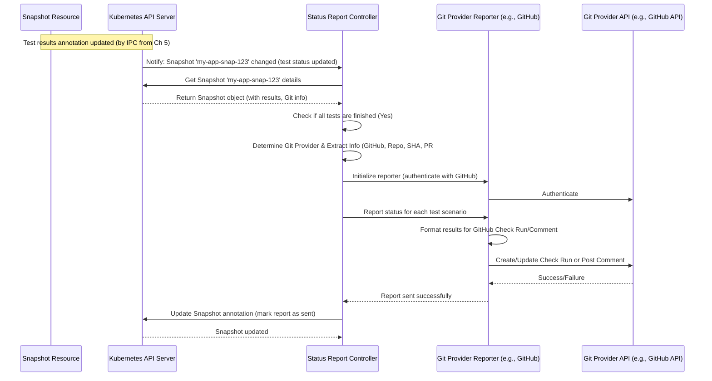

# Chapter 6: Status Reporting

In [Chapter 5: Integration Pipeline Controller](05_integration_pipeline_controller_.md), we saw how the "Scorekeeper" (Integration Pipeline Controller) watches the integration tests (Tekton `PipelineRun`s) and records their pass/fail status back onto the [Snapshot](01_snapshot_.md).

That's fantastic! The results are now officially recorded. But how do the developers who made the code change actually *see* these results easily? Having to dig through Kubernetes resources isn't ideal. They want to see the test outcomes right where they work – on their Pull Request (PR) or Merge Request (MR) in GitHub or GitLab.

This is where **Status Reporting** steps in.

## What is Status Reporting?

Think of Status Reporting as the **Messenger** whose job is to take the final test results from the [Snapshot](01_snapshot_.md) and deliver them back to the place the original code change came from.

Specifically, the Status Reporting mechanism:

1.  **Waits for Results:** It watches the [Snapshot](01_snapshot_.md) until all the integration tests associated with it have finished running.
2.  **Reads the Scorecard:** It looks at the aggregated test statuses recorded on the Snapshot (by the [Integration Pipeline Controller](05_integration_pipeline_controller_.md)).
3.  **Finds the Destination:** It figures out which Git provider (like GitHub or GitLab) and which specific PR/MR or commit triggered this whole process by looking at labels and annotations on the Snapshot.
4.  **Delivers the Message:** It uses the Git provider's API (like GitHub Checks, GitHub Commit Statuses, GitLab Commit Statuses, or PR/MR comments) to post the test results directly onto the relevant code change.

This makes it super easy for developers to see if their changes passed integration testing without leaving their Git provider interface.

## How Does it Work?

The process is handled by a dedicated controller within the `integration-service`.

1.  **Tests Finish:** The [Integration Pipeline Controller](05_integration_pipeline_controller_.md) updates the [Snapshot](01_snapshot_.md)'s annotations to indicate that a specific test scenario (e.g., `my-app-login-test`) has completed with a status (e.g., "Passed").
2.  **Status Reporter Notices:** The Status Report controller detects this change in the Snapshot's test status annotations.
3.  **Check Completion:** It verifies if *all* required tests for the Snapshot have finished.
4.  **Gather Information:** If all tests are done, it reads:
    *   The final status of each test scenario from the Snapshot's annotations.
    *   Details about the Git repository, commit SHA, and PR/MR number from the Snapshot's labels and annotations (these were originally copied from the build PipelineRun by the [Build Pipeline Controller](03_build_pipeline_controller_.md)).
5.  **Select Reporter:** It determines the Git provider (GitHub, GitLab) based on the Snapshot's metadata and selects the appropriate "reporter" logic.
6.  **Authenticate:** It authenticates with the Git provider's API using credentials stored securely in the cluster (often related to Pipelines-as-Code integration).
7.  **Format and Send:** It formats the test results into the structure required by the provider's API (e.g., a GitHub Check Run or a GitLab Commit Status) and sends the request. It might create a new status, update an existing one, or post a comment.
8.  **Track Updates:** It often updates another annotation on the Snapshot to keep track of which results have been successfully reported, preventing duplicate messages.

## Under the Hood: Delivering the News

Let's visualize how the Status Reporter interacts with other parts when tests finish:



This shows the controller reacting to the updated Snapshot, initializing the correct reporter, formatting, and sending the status back to the Git provider API.

### Diving Deeper into the Code

The logic for status reporting is primarily located in `internal/controller/statusreport/` and the `status/` package.

**1. Watching for Changes (`statusreport_controller.go`)**

The controller watches for changes in the Snapshot's test status annotation.

```go
// Simplified from internal/controller/statusreport/statusreport_controller.go

// Reconcile is called when a Snapshot's test status annotation changes.
func (r *Reconciler) Reconcile(ctx context.Context, req ctrl.Request) (ctrl.Result, error) {
	logger := // ... setup logger ...
	loader := loader.NewLoader()

	logger.Info("Snapshot test status changed, processing...", "snapshot", req.NamespacedName)

	// 1. Get the Snapshot object
	snapshot := &applicationapiv1alpha1.Snapshot{}
	err := r.Get(ctx, req.NamespacedName, snapshot)
	// ... handle errors (like Not Found) ...

	// 2. Get the Application
	application, err := loader.GetApplicationFromSnapshot(ctx, r.Client, snapshot)
	// ... handle errors ...
	logger = logger.WithApp(*application)

	// 3. Create an Adapter to handle the logic
	adapter := NewAdapter(ctx, snapshot, application, logger, loader, r.Client)

	// 4. Execute operations
	return controller.ReconcileHandler([]controller.Operation{
		adapter.EnsureSnapshotFinishedAllTests,                // Check if all tests done
		adapter.EnsureSnapshotTestStatusReportedToGitProvider, // Send the report
		// adapter.EnsureGroupSnapshotCreationStatusReportedToGitProvider, // Handle special case
	})
}

// SetupController configures the controller to watch Snapshots
func setupControllerWithManager(manager ctrl.Manager, controller *Reconciler) error {
	return ctrl.NewControllerManagedBy(manager).
		For(&applicationapiv1alpha1.Snapshot{}).
		WithEventFilter(
			// Trigger only when the specific test status annotation changes
			gitops.SnapshotTestAnnotationChangePredicate(),
		).
		Complete(controller)
}
```

*   **Explanation:** The `Reconcile` function fetches the Snapshot and its Application when the test status annotation (`test.appstudio.openshift.io/status`) changes. It then uses an `Adapter` to perform the necessary actions, primarily checking if tests are complete and then reporting the status. The `setupControllerWithManager` part shows how the controller is configured to *only* trigger on relevant annotation changes using a specific predicate (`SnapshotTestAnnotationChangePredicate`).

**2. Coordinating the Report (`statusreport_adapter.go`)**

The adapter orchestrates the reporting process.

```go
// Simplified from internal/controller/statusreport/statusreport_adapter.go

// EnsureSnapshotTestStatusReportedToGitProvider sends the status report.
func (a *Adapter) EnsureSnapshotTestStatusReportedToGitProvider() (controller.OperationResult, error) {
	// ... Skip if not a component/group snapshot or if canceled ...

	// Call the main reporting function
	err := a.ReportSnapshotStatus(a.snapshot)
	if err != nil {
		a.logger.Error(err, "Failed to report test status to git provider", "snapshot", a.snapshot.Name)
		// Retry for a limited time if reporting fails
		if helpers.IsObjectYoungerThanThreshold(a.snapshot, SnapshotRetryTimeout) {
			return controller.RequeueWithError(err)
		}
		// Give up after timeout
		a.logger.Error(err, "Snapshot exceeded retry timeout for status reporting", "snapshot", a.snapshot.Name)
	}

	// ... Clean up finalizers on associated PipelineRuns if tests are done ...

	return controller.ContinueProcessing()
}

// ReportSnapshotStatus handles getting statuses, finding destinations, and calling the reporter.
func (a *Adapter) ReportSnapshotStatus(testedSnapshot *applicationapiv1alpha1.Snapshot) error {
	// 1. Load test statuses from the Snapshot annotation
	statuses, err := gitops.NewSnapshotIntegrationTestStatusesFromSnapshot(testedSnapshot)
	// ... handle error ...
	integrationTestStatusDetails := statuses.GetStatuses()
	if len(integrationTestStatusDetails) == 0 {
		a.logger.Info("No test results to report", "snapshot", testedSnapshot.Name)
		return nil // Nothing to do
	}

	// 2. Find which Snapshot(s) contain the Git provider info (could be the tested one or components of a group)
	destinationSnapshots, err := a.getDestinationSnapshots(testedSnapshot)
	// ... handle error ...

	// 3. Load the tracking info (which reports have been sent?)
	srs, _ := status.NewSnapshotReportStatusFromSnapshot(testedSnapshot) // Load status report tracking

	// 4. Loop through each destination Snapshot (where to report)
	for _, destinationComponentSnapshot := range destinationSnapshots {
		// 4a. Get the right reporter (GitHub, GitLab)
		reporter := a.status.GetReporter(destinationComponentSnapshot)
		if reporter == nil { continue } // Skip if no reporter found

		// 4b. Initialize the reporter (authenticate)
		if err := reporter.Initialize(a.context, destinationComponentSnapshot); err != nil {
			// ... handle error ...
			return err
		}

		// 4c. Use RetryOnConflict for potential parallel updates
		err = retry.RetryOnConflict(retry.DefaultRetry, func() error {
			// 4d. Report status details for this destination
			err := a.iterateIntegrationTestStatusDetailsInStatusReport(
				reporter, integrationTestStatusDetails, testedSnapshot, destinationComponentSnapshot, srs)
			if err != nil { return err }

			// 4e. Save the tracking info back to the tested Snapshot
			if err := status.WriteSnapshotReportStatus(a.context, a.client, testedSnapshot, srs); err != nil {
				return err // Propagate error to trigger retry
			}
			return nil // Success for this attempt
		})
		if err != nil { return err } // Return error if retries failed
	}
	return nil
}
```

*   **Explanation:** `EnsureSnapshotTestStatusReportedToGitProvider` calls `ReportSnapshotStatus`. `ReportSnapshotStatus` loads the test results from the Snapshot, finds the target Snapshot(s) that contain the Git provider information, gets the appropriate reporter (e.g., GitHub), initializes it (authenticates), and then calls `iterateIntegrationTestStatusDetailsInStatusReport` within a `RetryOnConflict` block to handle potential simultaneous updates. Finally, it saves the tracking data (`SnapshotReportStatus`) back to the Snapshot.

**3. Iterating and Formatting (`statusreport_adapter.go` and `status/status.go`)**

The adapter iterates through each test result and asks the reporter to send it.

```go
// Simplified from internal/controller/statusreport/statusreport_adapter.go

// iterateIntegrationTestStatusDetailsInStatusReport sends report for each test detail.
func (a *Adapter) iterateIntegrationTestStatusDetailsInStatusReport(
	reporter status.ReporterInterface,
	integrationTestStatusDetails []*intgteststat.IntegrationTestStatusDetail,
	testedSnapshot *applicationapiv1alpha1.Snapshot,
	destinationSnapshot *applicationapiv1alpha1.Snapshot,
	srs *status.SnapshotReportStatus) error { // srs tracks sent reports

	componentName := // ... determine component name or group name ...

	for _, testDetail := range integrationTestStatusDetails {
		// Check if this specific report is newer than the last one sent
		if !srs.IsNewer(testDetail.ScenarioName, destinationSnapshot.Name, testDetail.LastUpdateTime) {
			a.logger.Info("No new status updates for this scenario/destination", "scenario", testDetail.ScenarioName)
			continue // Skip sending old news
		}

		// Generate the report data (summary, text, etc.)
		testReport, reportErr := status.GenerateTestReport(a.context, a.client, *testDetail, testedSnapshot, componentName)
		if reportErr != nil { return reportErr } // Handle error

		// Ask the reporter to send the status
		if reportStatusErr := reporter.ReportStatus(a.context, *testReport); reportStatusErr != nil {
			return reportStatusErr // Handle error
		}

		// Mark this report as sent in our tracking data
		srs.SetLastUpdateTime(testDetail.ScenarioName, destinationSnapshot.Name, testDetail.LastUpdateTime)
		a.logger.Info("Successfully reported status", "snapshot", testedSnapshot.Name, "scenario", testDetail.ScenarioName)
	}
	return nil
}
```

```go
// Simplified from status/status.go

// GenerateTestReport creates the TestReport struct needed by reporters.
func GenerateTestReport(ctx context.Context, client client.Client, detail intgteststat.IntegrationTestStatusDetail, testedSnapshot *applicationapiv1alpha1.Snapshot, componentName string) (*TestReport, error) {
	// Generate the detailed text (potentially fetching TaskRun details)
	text, err := generateText(ctx, client, detail, testedSnapshot)
	// ... handle error ...

	// Generate a short summary string
	summary, err := GenerateSummary(detail.Status, testedSnapshot.Name, detail.ScenarioName)
	// ... handle error ...

	consoleName := // ... get console name (e.g., "Integration Service") ...
	fullName := // ... combine console name, scenario name, component name ...

	report := TestReport{
		Text:                text, // Detailed report, often Markdown
		FullName:            fullName, // Used for context/check name
		ScenarioName:        detail.ScenarioName,
		SnapshotName:        testedSnapshot.Name,
		ComponentName:       componentName,
		Status:              detail.Status, // Internal status enum
		Summary:             summary, // Short description
		StartTime:           detail.StartTime,
		CompletionTime:      detail.CompletionTime,
		TestPipelineRunName: detail.TestPipelineRunName, // Link back to logs
	}
	return &report, nil
}
```

*   **Explanation:** `iterateIntegrationTestStatusDetailsInStatusReport` loops through each test result from the Snapshot. It uses the `SnapshotReportStatus` (`srs`) helper to check if this result is newer than the last one reported for this specific scenario and destination Snapshot. If it's new, it calls `status.GenerateTestReport` to format the data (including potentially fetching TaskRun details for the `text` field using `status.FormatTestsSummary` from `format.go`). Then, it calls the specific `reporter.ReportStatus` method (e.g., for GitHub) and updates the tracking status (`srs.SetLastUpdateTime`).

**4. The Reporter Interface and Implementations (`status/reporter*.go`)**

Different reporters handle communication with specific Git providers.

```go
// Simplified from status/reporter.go

// ReporterInterface defines methods for status reporting.
type ReporterInterface interface {
	Detect(*applicationapiv1alpha1.Snapshot) bool // Can this reporter handle this Snapshot?
	Initialize(context.Context, *applicationapiv1alpha1.Snapshot) error // Authenticate
	GetReporterName() string // "GithubReporter", "GitlabReporter"
	ReportStatus(context.Context, TestReport) error // Send the actual status
}

// Simplified from status/reporter_github.go

// GitHubReporter implements ReporterInterface for GitHub.
type GitHubReporter struct {
	// ... client, logger, updater ...
}

// Initialize authenticates and sets up the correct updater (CheckRun or CommitStatus).
func (r *GitHubReporter) Initialize(ctx context.Context, snapshot *applicationapiv1alpha1.Snapshot) error {
	// ... extract owner, repo, sha from snapshot metadata ...

	if metadata.HasAnnotation(snapshot, gitops.PipelineAsCodeInstallationIDAnnotation) {
		// Use GitHub App integration (Check Runs)
		r.updater = NewCheckRunStatusUpdater(/*... args ...*/)
	} else {
		// Use webhook integration (Commit Statuses / Comments)
		r.updater = NewCommitStatusUpdater(/*... args ...*/)
	}

	// Authenticate the chosen updater
	return r.updater.Authenticate(ctx, snapshot)
}

// ReportStatus calls the updater's method.
func (r *GitHubReporter) ReportStatus(ctx context.Context, report TestReport) error {
	if r.updater == nil { return fmt.Errorf("reporter not initialized") }
	return r.updater.UpdateStatus(ctx, report)
}

// CheckRunStatusUpdater sends status via GitHub Checks API.
type CheckRunStatusUpdater struct { /* ... fields ... */ }

// UpdateStatus creates or updates a GitHub Check Run.
func (cru *CheckRunStatusUpdater) UpdateStatus(ctx context.Context, report TestReport) error {
	// ... prepare CheckRunAdapter data from TestReport ...
	checkRunAdapter, err := cru.createCheckRunAdapterForSnapshot(report)
	// ... handle error ...

	// ... check if a CheckRun already exists ...
	existingCheckrun := cru.ghClient.GetExistingCheckRun(/* ... */)

	if existingCheckrun == nil {
		// Create a new Check Run
		_, err = cru.ghClient.CreateCheckRun(ctx, checkRunAdapter)
	} else {
		// Update the existing Check Run (or create new if completed)
		err = cru.ghClient.UpdateCheckRun(ctx, *existingCheckrun.ID, checkRunAdapter)
	}
	return err
}

// createCheckRunAdapterForSnapshot converts TestReport to GitHub API format.
func (cru *CheckRunStatusUpdater) createCheckRunAdapterForSnapshot(report TestReport) (*github.CheckRunAdapter, error) {
	conclusion, _ := generateCheckRunConclusion(report.Status) // e.g., "success", "failure"
	title, _ := generateCheckRunTitle(report.Status)           // e.g., "Succeeded", "Failed"
	externalID := // ... generate unique ID for this test/snapshot ...

	cra := &github.CheckRunAdapter{
		Owner:      cru.owner, Repository: cru.repo, Name: report.FullName, SHA: cru.sha,
		ExternalID: externalID, Conclusion: conclusion, Title: title,
		Summary: report.Summary, Text: report.Text, // Text contains the formatted Markdown
		StartTime: *report.StartTime, CompletionTime: *report.CompletionTime,
		DetailsURL: // ... link back to pipeline logs ...
	}
	return cra, nil
}
```

*   **Explanation:** The code defines a common `ReporterInterface`. The `GitHubReporter` implements this. Its `Initialize` method figures out whether to use the GitHub App (Check Runs) or webhook (Commit Statuses/Comments) method based on Snapshot annotations and creates the appropriate `updater` (`CheckRunStatusUpdater` or `CommitStatusUpdater`). It then authenticates the updater. The `ReportStatus` method simply delegates to the chosen `updater`. The `CheckRunStatusUpdater`'s `UpdateStatus` method prepares the data using `createCheckRunAdapterForSnapshot` (translating internal status to GitHub's `conclusion` and `title`) and calls the GitHub client (`github.go`) to create or update the check run via the GitHub API. Similar logic exists in `reporter_gitlab.go` for GitLab.

## What the Developer Sees

After the Status Reporter runs, a developer looking at their Pull Request on GitHub might see:

*   **Check Runs:** An entry in the "Checks" tab showing each integration test scenario, its status (queued, in progress, success, failure), a summary, and a link to the detailed logs.
    ```
    ✅ Integration Service / login-test / my-component - Succeeded
       Integration test for snapshot my-app-snap-123 and scenario login-test has passed
       (Details link to logs)
    ```
*   **Comments:** A comment posted by the integration service bot summarizing the results, often with a table similar to the output of `status.FormatTestsSummary`.
*   **Commit Status:** A small icon (tick, cross, dot) next to the commit hash, with the test scenario name as context.

This immediate feedback within the developer's workflow is the primary goal of Status Reporting.

## Conclusion

You've learned about **Status Reporting**, the crucial messenger that bridges the gap between the test results stored in the [Snapshot](01_snapshot_.md) and the developer's view in the Git provider. It watches for completed tests, formats the results, and uses provider APIs (like GitHub Checks or GitLab Commit Statuses) to display the outcomes directly on the relevant PR/MR or commit. This provides vital, timely feedback to developers about the quality of their changes.

We've covered the core controllers and resources involved in triggering and monitoring tests. But how are the actual test *pipelines* (the Tekton definitions) managed and referenced?

Let's move on to [Chapter 7: Tekton Pipeline Management](07_tekton_pipeline_management_.md) to understand how test pipelines are organized and accessed.

---

Generated by [AI Codebase Knowledge Builder](https://github.com/The-Pocket/Tutorial-Codebase-Knowledge)