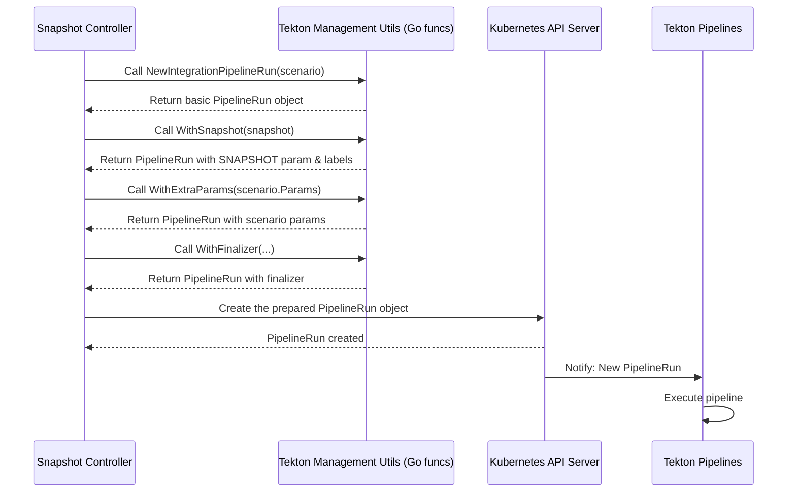

# Chapter 7: Tekton Pipeline Management

Welcome to Chapter 7! In [Chapter 6: Status Reporting](06_status_reporting_.md), we saw how the `integration-service` acts as a messenger, reporting the final test results from a [Snapshot](01_snapshot_.md) back to the developers on their Git provider (like GitHub or GitLab).

We know the tests ran and we know their results. But how did the service actually *interact* with Tekton, the engine running those tests? How did it tell Tekton to start a specific test using a specific [Snapshot](01_snapshot_.md)? How did it read the specific outputs from a build pipeline to create that Snapshot in the first place?

This chapter introduces **Tekton Pipeline Management**, which isn't a controller itself, but rather the set of tools and helper functions *within* the `integration-service` that allow it to work directly with Tekton `PipelineRun` resources in Kubernetes.

## What is Tekton Pipeline Management?

Imagine Tekton is like a sophisticated workshop full of tools and machines capable of running complex tasks (pipelines). The `integration-service` needs to operate this workshop to get its job done (building and testing).

**Tekton Pipeline Management** is the `integration-service`'s **master toolkit and operator's manual** for this Tekton workshop. It contains specialized functions and pre-defined procedures for common tasks like:

1.  **Starting a Job:** How to correctly prepare and submit a new job order (a Tekton `PipelineRun`) to the workshop, ensuring it has all the necessary instructions (parameters like the `SNAPSHOT`) and labels (like which [Snapshot](01_snapshot_.md) and [IntegrationTestScenario](02_integrationtestscenario_.md) it's for).
2.  **Inspecting the Output:** How to read specific measurements or results produced by a finished job (like the exact image digest from a build `PipelineRun` or a test summary from a test `PipelineRun`).
3.  **Labeling and Tagging:** How to properly attach identification labels and tracking annotations to the jobs running in the workshop (e.g., marking a build `PipelineRun` with the name of the [Snapshot](01_snapshot_.md) created from it).
4.  **Managing Cleanup:** How to ensure proper setup and cleanup procedures are followed for each job using Tekton's built-in mechanisms (like finalizers, which prevent a `PipelineRun` from being deleted before the service is done with it).

Essentially, it's the collection of Go code functions within the `integration-service` that makes interacting with Tekton easier, more reliable, and standardized across the different controllers ([Build Pipeline Controller](03_build_pipeline_controller_.md), [Snapshot Controller](04_snapshot_controller_.md), [Integration Pipeline Controller](05_integration_pipeline_controller_.md)).

## Why Do We Need It?

Working directly with Tekton `PipelineRun` resources involves creating complex YAML or JSON structures, setting specific labels/annotations, parsing results, and handling edge cases. Without a dedicated toolkit, each controller would need to implement this logic independently, leading to:

*   **Duplication:** The same code for creating a `PipelineRun` or reading a result might appear in multiple controllers.
*   **Inconsistency:** Different controllers might label `PipelineRun`s differently or extract results in slightly different ways, making debugging harder.
*   **Complexity:** Each controller would be more complex, mixing its core logic (e.g., watching Snapshots) with the low-level details of Tekton interaction.

The Tekton Pipeline Management utilities solve this by providing a central, reusable set of functions. Controllers can simply call these functions, like `tekton.NewIntegrationPipelineRun(...)` or `tekton.GetOutputImageDigest(...)`, focusing on their main task rather than the intricacies of Tekton's API.

## Key Operations

Let's look at some key tasks handled by this toolkit, used by the controllers we've already learned about.

### 1. Creating Integration PipelineRuns

When the [Snapshot Controller](04_snapshot_controller_.md) decides to run a test based on an [IntegrationTestScenario](02_integrationtestscenario_.md), it uses a builder pattern provided by the toolkit to construct the `PipelineRun` resource.

```go
// Simplified from tekton/integration_pipeline.go

// NewIntegrationPipelineRun creates an empty PipelineRun for a scenario.
func NewIntegrationPipelineRun(prefix, namespace string, scenario v1beta2.IntegrationTestScenario) *IntegrationPipelineRun {
	// ... logic to prepare resolver parameters from scenario ...

	pipelineRun := tektonv1.PipelineRun{
		ObjectMeta: metav1.ObjectMeta{
			GenerateName: prefix + "-", // e.g., "scenario-name-"
			Namespace:    namespace,
		},
		Spec: tektonv1.PipelineRunSpec{
			PipelineRef: &tektonv1.PipelineRef{
				ResolverRef: tektonv1.ResolverRef{ // Uses info from scenario
					Resolver: tektonv1.ResolverName(scenario.Spec.ResolverRef.Resolver),
					Params:   resolverParams,
				},
			},
		},
	}
	// Wrap in our helper type
	return &IntegrationPipelineRun{pipelineRun}
}

// WithSnapshot adds SNAPSHOT param and labels.
func (r *IntegrationPipelineRun) WithSnapshot(snapshot *applicationapiv1alpha1.Snapshot) *IntegrationPipelineRun {
	snapshotString, _ := json.Marshal(snapshot.Spec) // Convert Snapshot spec to JSON string

	// Add the SNAPSHOT parameter
	r.WithExtraParam("SNAPSHOT", tektonv1.ParamValue{
		Type:      tektonv1.ParamTypeString,
		StringVal: string(snapshotString),
	})

	// Add labels to link PLR back to Snapshot
	if r.ObjectMeta.Labels == nil { r.ObjectMeta.Labels = map[string]string{} }
	r.ObjectMeta.Labels[SnapshotNameLabel] = snapshot.Name
	// ... copy other relevant labels/annotations from Snapshot ...

	return r
}

// WithExtraParams adds parameters defined in the scenario spec.
func (r *IntegrationPipelineRun) WithExtraParams(params []v1beta2.PipelineParameter) *IntegrationPipelineRun {
	for _, param := range params {
		// ... logic to convert scenario param to Tekton param ...
		r.WithExtraParam(param.Name, value) // Add each param
	}
	return r
}
```

*   **Explanation:** The `NewIntegrationPipelineRun` function creates the basic `PipelineRun` structure, setting the `resolverRef` based on the [IntegrationTestScenario](02_integrationtestscenario_.md). Methods like `WithSnapshot` and `WithExtraParams` then chain together to add the crucial `SNAPSHOT` parameter (containing the [Snapshot](01_snapshot_.md) details as a JSON string) and any other parameters specified in the scenario. It also adds important labels linking the `PipelineRun` back to the Snapshot and Scenario. The [Snapshot Controller](04_snapshot_controller_.md) uses this builder to easily generate the correct `PipelineRun` object before creating it in Kubernetes.

### 2. Extracting Results from PipelineRuns

After a `PipelineRun` finishes, controllers often need to read specific outputs (called "Results" in Tekton). For example, the [Build Pipeline Controller](03_build_pipeline_controller_.md) needs the exact image URL and digest from the build `PipelineRun` to create the [Snapshot](01_snapshot_.md).

```go
// Simplified from tekton/utils.go

// GetOutputImageDigest returns the IMAGE_DIGEST result value.
func GetOutputImageDigest(object client.Object) (string, error) {
	pipelineRun, ok := object.(*tektonv1.PipelineRun)
	if ok {
		// Loop through results in the PipelineRun's status
		for _, pipelineResult := range pipelineRun.Status.Results {
			if pipelineResult.Name == PipelineRunImageDigestParamName { // "IMAGE_DIGEST"
				return pipelineResult.Value.StringVal, nil // Return the value
			}
		}
	}
	// Return error if not found
	return "", h.MissingInfoInPipelineRunError(pipelineRun.Name, PipelineRunImageDigestParamName)
}

// GetComponentSourceGitCommit returns the CHAINS-GIT_COMMIT result value.
func GetComponentSourceGitCommit(object client.Object) (string, error) {
	pipelineRun, ok := object.(*tektonv1.PipelineRun)
	if ok {
		// Loop through results
		for _, pipelineResult := range pipelineRun.Status.Results {
			if pipelineResult.Name == PipelineRunChainsGitCommitParamName { // "CHAINS-GIT_COMMIT"
				return pipelineResult.Value.StringVal, nil
			}
		}
	}
	// Return error if not found
	return "", h.MissingInfoInPipelineRunError(pipelineRun.Name, PipelineRunChainsGitCommitParamName)
}
```

*   **Explanation:** Functions like `GetOutputImageDigest` and `GetComponentSourceGitCommit` provide a simple way for controllers to get specific named results from a finished `PipelineRun`. They hide the details of looping through the `pipelineRun.Status.Results` array. The [Build Pipeline Controller](03_build_pipeline_controller_.md) calls these helpers to get the data needed for the [Snapshot](01_snapshot_.md).

### 3. Managing Labels and Annotations

Labels and annotations are crucial for linking resources and tracking state. The toolkit provides helpers for managing these on `PipelineRun`s. For instance, after the [Build Pipeline Controller](03_build_pipeline_controller_.md) successfully creates a [Snapshot](01_snapshot_.md), it needs to annotate the original build `PipelineRun` to mark that it has been processed.

```go
// Simplified from tekton/build_pipeline.go

// AnnotateBuildPipelineRun sets an annotation on a build pipelineRun.
func AnnotateBuildPipelineRun(ctx context.Context, pipelineRun *tektonv1.PipelineRun, key, value string, cl client.Client) error {
	patch := client.MergeFrom(pipelineRun.DeepCopy()) // Prepare for patching

	// Use helper from operator-toolkit to set the annotation
	_ = metadata.SetAnnotation(&pipelineRun.ObjectMeta, key, value)

	// Apply the patch to update the object in Kubernetes
	err := cl.Patch(ctx, pipelineRun, patch)
	if err != nil {
		return err
	}
	return nil
}
```

*   **Explanation:** This function `AnnotateBuildPipelineRun` (and a similar `LabelBuildPipelineRun`) takes a `PipelineRun`, a key-value pair, and the Kubernetes client. It uses standard Kubernetes client-go patching mechanisms along with helpers (`metadata.SetAnnotation`) to safely add or update an annotation on the live `PipelineRun` object in the cluster. The [Build Pipeline Controller](03_build_pipeline_controller_.md) calls this to add the `test.appstudio.openshift.io/snapshot-name` annotation after creating the Snapshot.

### 4. Handling Finalizers

Finalizers are a Kubernetes mechanism to ensure resources aren't deleted until specific cleanup actions are completed. The `integration-service` uses them on `PipelineRun`s it manages. For example, an integration test `PipelineRun` might have a finalizer added when created. The [Integration Pipeline Controller](05_integration_pipeline_controller_.md) only removes this finalizer after it has successfully updated the [Snapshot](01_snapshot_.md) with the final test result, ensuring the result isn't lost if someone tries to delete the `PipelineRun` prematurely.

```go
// Simplified from tekton/integration_pipeline.go

// WithFinalizer adds a Finalizer to the Integration PipelineRun.
func (iplr *IntegrationPipelineRun) WithFinalizer(finalizer string) *IntegrationPipelineRun {
	// Uses a standard controller-runtime utility to add the finalizer string
	controllerutil.AddFinalizer(iplr, finalizer)
	return iplr
}

// --- In the Integration Pipeline Controller ---
// Simplified logic to remove the finalizer when done:

func (a *Adapter) removeFinalizerIfNeeded() error {
    if h.HasPipelineRunFinished(a.pipelineRun) && controllerutil.ContainsFinalizer(a.pipelineRun, h.IntegrationPipelineRunFinalizer) {
        patch := client.MergeFrom(a.pipelineRun.DeepCopy())
        controllerutil.RemoveFinalizer(a.pipelineRun, h.IntegrationPipelineRunFinalizer)
        err := a.client.Patch(a.context, a.pipelineRun, patch)
        // ... handle error ...
        a.logger.Info("Removed finalizer from completed/deleted PipelineRun")
    }
    return nil
}
```

*   **Explanation:** The `WithFinalizer` method, used by the builder when creating the `PipelineRun`, simply adds a specific string (the finalizer name) to the `PipelineRun`'s metadata. Later, the controller responsible (like the [Integration Pipeline Controller](05_integration_pipeline_controller_.md)) explicitly checks if the finalizer exists and if the `PipelineRun` is finished. If both are true, it uses `controllerutil.RemoveFinalizer` and patches the object to remove the finalizer, allowing Kubernetes to then garbage collect the `PipelineRun`.

## Under the Hood: How Controllers Use the Toolkit

Let's revisit the flow where the [Snapshot Controller](04_snapshot_controller_.md) starts an integration test. It relies heavily on the Tekton Pipeline Management toolkit.



*   **Explanation:** This diagram shows the [Snapshot Controller](04_snapshot_controller_.md) interacting with the Tekton Management utilities (represented here as a single entity for simplicity, though it's just Go functions). The controller calls builder methods (`NewIntegrationPipelineRun`, `WithSnapshot`, `WithExtraParams`, `WithFinalizer`) provided by the toolkit to construct the `PipelineRun` object step-by-step. Only once the object is fully prepared does the controller interact directly with the Kubernetes API (`Create`) to submit the job to Tekton.

## Conclusion

You've learned about **Tekton Pipeline Management**, the internal toolkit the `integration-service` uses to interact with Tekton `PipelineRun`s. It's not a controller itself, but a collection of helper functions and patterns used *by* the controllers. This toolkit simplifies:

*   Creating new `PipelineRun`s with the correct parameters, labels, and resolvers.
*   Extracting specific results from completed `PipelineRun`s.
*   Managing labels and annotations for tracking and linking.
*   Handling finalizers to ensure proper cleanup and state management.

By centralizing these Tekton-specific operations, the toolkit makes the individual controllers simpler, more consistent, and easier to maintain.

Just as the Tekton Pipeline Management utilities help interact with Tekton resources, the service also needs ways to efficiently find and load related Kubernetes resources (like Applications, Components, Snapshots). How does it do that?

Let's move on to the final chapter, [Chapter 8: Resource Loading](08_resource_loading_.md), to explore the utilities used for fetching objects from the Kubernetes cluster.

---

Generated by [AI Codebase Knowledge Builder](https://github.com/The-Pocket/Tutorial-Codebase-Knowledge)