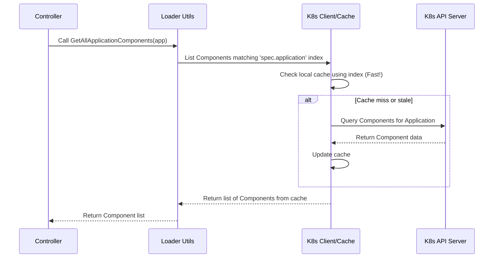

# Chapter 8: Resource Loading

Welcome to the final chapter of the `integration-service` tutorial! In [Chapter 7: Tekton Pipeline Management](07_tekton_pipeline_management_.md), we looked at the toolkit the service uses to interact with Tekton `PipelineRun`s – how it starts them, reads their results, and manages their lifecycle.

But our controllers don't just interact with `PipelineRun`s. They constantly need information about other Kubernetes resources like Applications, Components, [Snapshot](01_snapshot_.md)s, and [IntegrationTestScenario](02_integrationtestscenario_.md)s. For example, when the [Build Pipeline Controller](03_build_pipeline_controller_.md) sees a build finish for a specific `Component`, it needs to find the `Application` that Component belongs to, and then find *all other Components* of that Application to create a complete [Snapshot](01_snapshot_.md).

How does it efficiently find all these related pieces of information within the Kubernetes cluster? Doing direct Kubernetes API calls everywhere would be repetitive and clutter the controller logic. This is where **Resource Loading** comes in.

## What is Resource Loading?

Think of the `integration-service` needing information like needing books from a vast library (your Kubernetes cluster). Instead of every controller knowing the exact shelf and location of every book (resource) and how they relate, we have a central **Librarian**.

The **Resource Loading** mechanism is this librarian. It's a collection of helper functions within the `integration-service` that know exactly how to:

1.  **Find Specific Items:** Get a particular resource if you know its name (e.g., "Get me the Application named 'my-web-app'").
2.  **Find Related Items:** Find resources based on their relationships or labels (e.g., "Find all Components belonging to the 'my-web-app' Application", or "Find all [IntegrationTestScenario](02_integrationtestscenario_.md)s for 'my-web-app'").
3.  **Use the Catalog:** Leverage efficient ways (like indexed caches, similar to a library's card catalog) to quickly find resources without always searching the entire library.

This "librarian" abstracts away the repetitive details of querying the Kubernetes API, providing controllers with simple functions to get the resources they need.

## How Does it Help?

Using a dedicated Resource Loader provides several benefits:

*   **Simplicity:** Controllers don't need complex Kubernetes query logic embedded within them. They just ask the loader for what they need (e.g., `loader.GetAllApplicationComponents(ctx, client, application)`).
*   **Consistency:** All controllers fetch resources in the same standardized way, using the same optimized queries.
*   **Reusability:** The same function to get all components for an application can be used by the [Build Pipeline Controller](03_build_pipeline_controller_.md), the [Snapshot Controller](04_snapshot_controller_.md), or any other part of the service that needs it.
*   **Efficiency:** The loader often uses caching and indexing (explained below) to make fetching resources faster than direct API calls every time.

## Using the Loader: A Librarian Request

Let's imagine the [Snapshot Controller](04_snapshot_controller_.md) needs to find all the [IntegrationTestScenario](02_integrationtestscenario_.md) definitions for the `my-web-app` Application when a new [Snapshot](01_snapshot_.md) arrives. Instead of writing the Kubernetes API query itself, it uses the loader:

```go
// Inside a controller's Reconcile function...

// application is the Application object we already have
// loader is an instance of the ObjectLoader interface
// client is the Kubernetes client
// ctx is the context

// Ask the loader (librarian) to find all scenarios for this application
allScenarios, err := loader.GetAllIntegrationTestScenariosForApplication(ctx, r.Client, application)
if err != nil {
    // Handle error: Maybe the librarian couldn't find anything or there was a system issue
    logger.Error(err, "Failed to load IntegrationTestScenarios")
    return ctrl.Result{}, err
}

// If successful, 'allScenarios' now holds a list of IntegrationTestScenario objects
logger.Info(fmt.Sprintf("Found %d scenarios", len(*allScenarios)))

// Now the controller can proceed to use these scenarios...
// (e.g., filter them, create PipelineRuns like we saw in Chapter 4)

```

*   **Explanation:** The controller simply calls `loader.GetAllIntegrationTestScenariosForApplication`, passing the context, the Kubernetes client, and the `Application` object it's interested in. The loader function handles the details of querying the cluster and returns a list (`*[]v1beta2.IntegrationTestScenario`) of matching scenarios or an error.

## Under the Hood: How the Librarian Works

How does the loader efficiently find these resources? It relies on two main things: Kubernetes client-go caching and specific query logic.

### 1. The Card Catalog: Caching and Indexing (`cache/cache.go`)

Kubernetes controllers typically don't query the main Kubernetes API server for *every single request*. Instead, they maintain a local **cache** of resources they watch. This is much faster.

To make searching this cache even faster, especially for finding related objects (like "all Components for Application X"), the `integration-service` sets up **indexes** on the cache when it starts up. Think of this like the library creating specific card catalogs (indexes) that group books by author or subject.

```go
// Simplified from cache/cache.go

// SetupApplicationComponentCache adds an index to quickly find Components by Application name.
func SetupApplicationComponentCache(mgr ctrl.Manager) error {
	applicationComponentIndexFunc := func(obj client.Object) []string {
		// This function tells the cache how to get the Application name from a Component object
		return []string{obj.(*applicationapiv1alpha1.Component).Spec.Application}
	}

	// Tell the manager's cache to index Component objects using the 'spec.application' field
	return mgr.GetCache().IndexField(context.Background(), &applicationapiv1alpha1.Component{},
		"spec.application", applicationComponentIndexFunc)
}

// Similar setup functions exist for other relationships:
// - SetupIntegrationTestScenarioCache (index Scenarios by Application)
// - SetupSnapshotCache (index Snapshots by Application)
// - SetupReleasePlanCache (index ReleasePlans by Application)
// - SetupReleaseCache (index Releases by Snapshot)
```

*   **Explanation:** This code, run when the `integration-service` starts, configures the controller manager's cache. It tells the cache: "When you store `Component` objects, also keep an index based on the value in their `spec.application` field." This allows the loader later to very quickly ask the cache: "Give me all `Component`s where `spec.application` equals 'my-web-app'".

### 2. The Librarian's Search Strategy (`loader/loader.go`)

The actual loader functions use the Kubernetes client (which utilizes the cache and indexes) to perform the lookups.

Let's look at a simplified version of the `GetAllApplicationComponents` function:

```go
// Simplified from loader/loader.go

// GetAllApplicationComponents loads all Components associated with the given Application.
func (l *loader) GetAllApplicationComponents(ctx context.Context, c client.Client, application *applicationapiv1alpha1.Application) (*[]applicationapiv1alpha1.Component, error) {
	// Prepare an empty list to store the results
	applicationComponents := &applicationapiv1alpha1.ComponentList{}

	// Define the query options
	opts := []client.ListOption{
		// Look only in the same namespace as the Application
		client.InNamespace(application.Namespace),
		// Use the index we set up earlier! Match the 'spec.application' field.
		client.MatchingFields{"spec.application": application.Name},
	}

	// Execute the list query using the client
	err := c.List(ctx, applicationComponents, opts...)
	if err != nil {
		// Handle potential errors during the query
		return nil, err
	}

	// Return the list of found components
	return &applicationComponents.Items, nil
}
```

*   **Explanation:** This function takes the context, client, and the target `Application`. It creates options for the `List` call, specifying the correct namespace and, crucially, using `client.MatchingFields`. This tells the client library to use the pre-configured index on the `spec.application` field for an efficient lookup. It then calls `c.List` and returns the result. Other loader functions use similar patterns, sometimes matching labels (`client.MatchingLabels`) or fetching single objects (`c.Get`).

Here's a sequence diagram showing a controller using the loader:



*   **Explanation:** The controller asks the Loader. The Loader uses the Kubernetes Client, which first checks its local cache using the efficient index. Only if the data isn't in the cache (or is too old) does it need to talk to the main Kubernetes API Server. The results are then returned to the controller.

### 3. Mocking for Tests (`loader/loader_mock.go`)

Testing controllers often requires pretending certain resources exist in the cluster. The `integration-service` includes a mock version of the loader (`loader/loader_mock.go`). In tests, developers can tell this mock loader exactly what resources (or errors) to return when a specific loader function is called. This allows testing controller logic without needing a real Kubernetes cluster running.

```go
// Example usage in a test:
import (
    // ... other imports
    "github.com/konflux-ci/integration-service/loader"
    toolkit "github.com/konflux-ci/operator-toolkit/loader"
)

// Create a mock loader
mockLoader := loader.NewMockLoader()

// Define the Application we expect the controller to ask for
testApplication := &applicationapiv1alpha1.Application{ /* ... */ }

// Tell the mock loader to return 'testApplication' when GetApplicationFromSnapshot is called
ctx := context.WithValue(context.Background(), loader.ApplicationContextKey, toolkit.GetMockedResource(testApplication))

// Now, when the controller code calls:
// app, err := mockLoader.GetApplicationFromSnapshot(ctx, fakeClient, snapshot)
// It will receive 'testApplication' and no error, without any actual API call.
```

*   **Explanation:** The test sets up a `MockLoader`. It then puts the desired fake resource (e.g., `testApplication`) into the context using a specific key (`loader.ApplicationContextKey`). The `MockLoader` implementation is designed to check the context for these keys first before attempting any real (or default mock) action.

## Conclusion

Congratulations! You've reached the end of the `integration-service` tutorial. In this final chapter, you learned about **Resource Loading**, the service's internal "librarian." It provides a set of consistent, reusable, and efficient functions for controllers to fetch Kubernetes resources like Applications, Components, Snapshots, and Scenarios. By using indexed caches and abstracting query logic, the loader simplifies controller development and improves performance.

Throughout this tutorial, we've explored the key concepts:

*   [Snapshot](01_snapshot_.md): Capturing the state of an application after a build.
*   [IntegrationTestScenario](02_integrationtestscenario_.md): Defining *how* to test a Snapshot.
*   [Build Pipeline Controller](03_build_pipeline_controller_.md): Creating Snapshots when builds complete.
*   [Snapshot Controller](04_snapshot_controller_.md): Triggering tests based on Snapshots and Scenarios.
*   [Integration Pipeline Controller](05_integration_pipeline_controller_.md): Monitoring test PipelineRuns and updating Snapshot status.
*   [Status Reporting](06_status_reporting_.md): Sending test results back to the Git provider.
*   [Tekton Pipeline Management](07_tekton_pipeline_management_.md): Utilities for interacting with Tekton PipelineRuns.
*   [Resource Loading](08_resource_loading_.md): Utilities for fetching Kubernetes resources efficiently.

Together, these components form the `integration-service`, providing a robust framework for automating integration testing within the Konflux / AppStudio ecosystem. We hope this tutorial has given you a solid foundation for understanding how it works!

---

Generated by [AI Codebase Knowledge Builder](https://github.com/The-Pocket/Tutorial-Codebase-Knowledge)