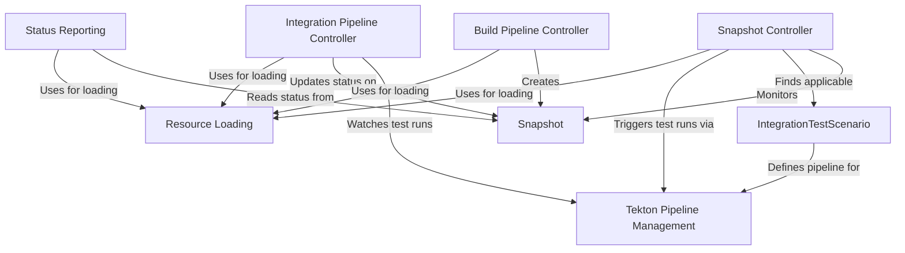

# Tutorial: integration-service

The **integration-service** orchestrates *integration tests* for applications within the Konflux CI/CD system.
It automatically watches for completed **builds**, captures the application state as a **Snapshot**,
then uses user-defined **IntegrationTestScenarios** to trigger the appropriate *Tekton* test pipelines.
Finally, it monitors these test runs and reports the PASS/FAIL status back to the originating **Git provider** (like GitHub or GitLab).

**Source Repository:** [https://github.com/konflux-ci/integration-service](https://github.com/konflux-ci/integration-service)

## Chapters

1. [Snapshot
](01_snapshot_.md)
2. [IntegrationTestScenario
](02_integrationtestscenario_.md)
3. [Build Pipeline Controller
](03_build_pipeline_controller_.md)
4. [Snapshot Controller
](04_snapshot_controller_.md)
5. [Integration Pipeline Controller
](05_integration_pipeline_controller_.md)
6. [Status Reporting
](06_status_reporting_.md)
7. [Tekton Pipeline Management
](07_tekton_pipeline_management_.md)
8. [Resource Loading
](08_resource_loading_.md)

---

Generated by [AI Codebase Knowledge Builder](https://github.com/The-Pocket/Tutorial-Codebase-Knowledge)